**apis-main\_controller Specification**
=====
**Rev 0.76**

# **Contents**
- [**apis-main\_controller Specification**](#apis-main_controller-specification)
- [**Contents**](#contents)
- [**1.Terms and abbreviations**](#1terms-and-abbreviations)
- [**2. Overview**](#2-overview)
- [**3. Software configuration**](#3-software-configuration)
  - [**3.1 Software overview**](#31-software-overview)
  - [**3.2. Software connection configuration**](#32-software-connection-configuration)
- [**4. Functions**](#4-functions)
  - [**4.1. Display module**](#41-display-module)
  - [**4.2. Controller module**](#42-controller-module)
    - [**4.2.1. Bottle Web Server**](#421-bottle-web-server)
    - [**4.2.2. Data Collector**](#422-data-collector)
    - [**4.2.3. Scheduler**](#423-scheduler)
- [**5. Communication specifications**](#5-communication-specifications)
  - [**5.1. User – Main Controller Web API**](#51-user--main-controller-web-api)
  - [**5.2. Main Controller - apis-web Web API**](#52-main-controller---apis-web-web-api)
- [**6. Information Collection**](#6-information-collection)
  - [**6.1. Information collected from Main Controller by User**](#61-information-collected-from-main-controller-by-user)
    - [**6.1.1. Node data collected from Main Controller by User**](#611-node-data-collected-from-main-controller-by-user)
    - [**6.1.2. Energy sharing data collected from Main Controller by User**](#612-energy-sharing-data-collected-from-main-controller-by-user)
  - [**6.2. Data collected from apis-web by Main Controller**](#62-data-collected-from-apis-web-by-main-controller)
    - [**6.2.1. Node data collected from Emulator Emulator by Main Controller**](#621-node-data-collected-from-emulator-emulator-by-main-controller)
    - [**6.2.2. Energy sharing data collected from Budo Emulator by Main Controller**](#622-energy-sharing-data-collected-from-budo-emulator-by-main-controller)
- [**7. Configuration file**](#7-configuration-file)
  - [**7.1. startMain.py**](#71-startmainpy)
  - [**7.2. logging.conf**](#72-loggingconf)
- [**8. Log output**](#8-log-output)
  - [**8.1. Log Level**](#81-log-level)
  - [**8.2. Log output destination**](#82-log-output-destination)
- [**9. Handling of abnormalities**](#9-handling-of-abnormalities)
- [**10. Security**](#10-security)
  - [**10.1. Security of User-Main Controller communication**](#101-security-of-user-main-controller-communication)
  - [**10.2. Security of Main Controller-apis-web communication**](#102-security-of-main-controller-apis-web-communication)
- [**11. Privacy**](#11-privacy)
- [**12. OSS licensing**](#12-oss-licensing)
- [**13. Tips**](#13-tips)

# **1.Terms and abbreviations**

| **Term**          | **Explanation**|
| ----------------- | ----------------------------------------------------------------------------------------------------------------------------------------------------------------------------------------------------------------------------------------------------------------------------------------------------------------------------------------------------------------------------------------------------------------------------------------------------------------------------------------- |
| apis-main         | Software for energy sharing developed by Sony CSL that enables autonomous decentralized control.|
| apis-web          | Software that provides Main Controller with information that is specific to each node installed by apis-main and information related to energy sharing between nodes. (See the apis-web specifications for more information.)|
| Budo Emulator     | An apis-web service that provides information on energy sharing between apis-main for the Main Controller and enables changing of settings such as energy sharing run or stop for individual nodes or all nodes of the apis-main. The “Emulator” in the term is used because this function emulates information provision by Budo, which is automatic energy sharing software for collection control that was used before apis-main was developed for autonomous and distributed control. |
| Emulator Emulator | An apis-web service that provides Main Controller with information that is specific to each apis-main and information on hardware such DC/DC converters and batteries. The name “Emulator Emulator” is used because this service provides emulation via the API of a previously developed hardware emulator for DC/DCD converters and batteries, etc.|
| Grid Master       | Name of service included in apis-main. Controls the DC grid for energy sharing.|
| Mediator          | An apis-main service that creates energy sharing transaction information by negotiation with other apis-main. This also has the function of invoking Grid Master when needed.|
| Hazelcast         | In-memory distributed computing library that accelerates applications by distributing data across multiple machines and doing parallel processing.|
| Vert.x            | A framework for implementing load-balancing programs. Using Hazelcast, the Event Bus is clustered and processed with load balancing.|
| Event Bus         | The basic processing unit of a Vert.x program is called a Verticle. The Event Bus is an asynchronous interface for verticle-to-verticle communications.|

 

# **2. Overview**

Main Controller is a web app for real-time display of the status of each node on which apis-main is installed, and the energy sharing status. The information required for display is obtained via the Web API provided by apis-web. It can also change the energy sharing operation mode of the cluster for operation and debugging, and control the DC/DC Converter of each node individually to implement energy sharing.

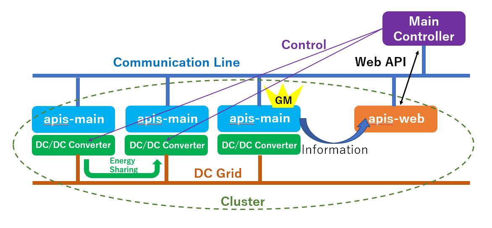  
Figure 2-1

 

# **3. Software configuration**

## **3.1 Software overview**

The software configuration of the Main Controller is broadly divided into a display module and a controller module (Figure 3-1). The display module has a standard configuration: Web content is structured with a TPL template, styled with CSS, and made dynamic with JavaScript. The controller is implemented with the Python Bottle Web app framework and provides three services: Bottle Web Server, Data Collector, and Scheduler.

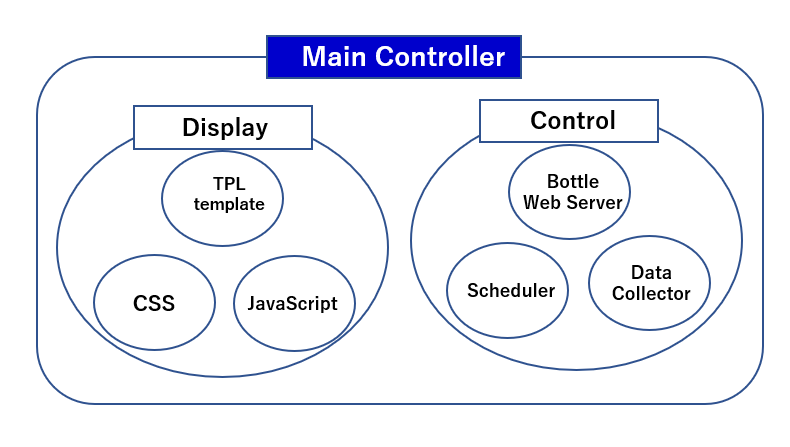  
Figure 3-1

 

## **3.2. Software connection configuration**

The software connection configuration for the Main Controller is illustrated in Figure 3-2. When User accesses Main Controller via HTTP, the Bottle Web Server of the controller receives the request. If the request is for display of the Main Controller screen, the TPL template of the display unit, the CSS, and the JavaScript are downloaded to the User browser and the screen is displayed. If screen display is not requested, the Bottle Web Server collects the required information and returns it to User. The Data Collector of the controller periodically accesses the Emulator Emulator of apis-web to get the data for all of the nodes running on apis-main and saves the data in the Main Controller cache. The data is retrieved from the cache by the display module JavaScript via periodic HTTP access to the Bottle Web Server via HTTP. The JavaScript similarly obtains all of the energy sharing data from the apis-web Budo Emulator by periodically accessing the Bottle Web Server via HTTP. The script then used the data obtained in that way to change the screen display on the User browser. The Scheduler of the controller module manages the energy sharing mode of the apis-main. For example, if it is necessary to stop the energy sharing before noon of the following day to allow maintenance work, a date and time for stopping energy sharing before the maintenance work can be set in the Scheduler.

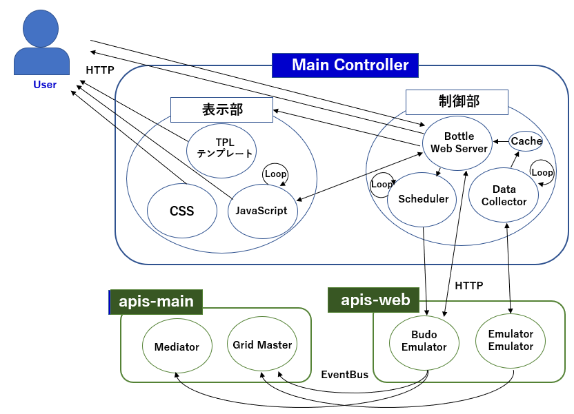 
Figure 3-2

 

# **4. Functions**
    
## **4.1. Display module**

The main screen for the Main Controller is shown in Figure 4-1. The status of the energy sharing currently in progress is illustrated by the block labeled (1) enclosed by the broken line; Block (2) shows the settings for the entire cluster and information on the energy sharing currently in progress; block (3) shows information on individual nodes and displays the DC/DC Converter control screen for each node. Each block is explained below.

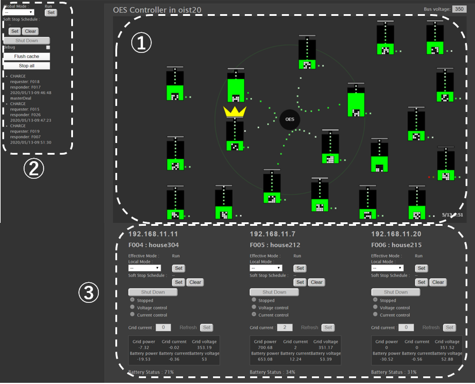  
Figure 4-1

 

1) Energy sharing screen   
   Each node on which apis-main is installed is represented as a rectangular box. During energy sharing, the nodes that are interchanging power are near the center of the screen and connected by dotted lines to indicate the interchange. A yellow crown shape above a box indicates that the node DC/DC converter is operating in constant voltage (CV) mode.  
   (For more information on energy sharing, refer to the apis-main specifications.)
   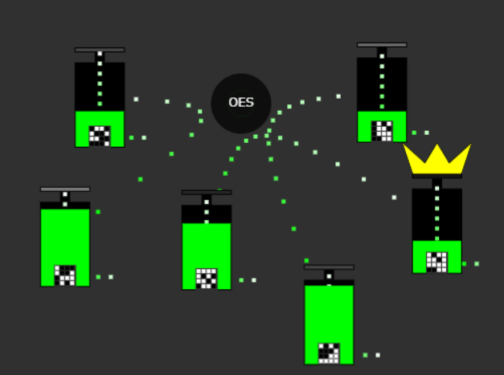  
   Figure 4-2  
    
   An enlarged view of a node box is shown in Figure 4-3. The dotted line above the box represents power supplied by PVC and the dotted line on the left side represents power supplied from the power grid. The dotted line on the right represents power consumption for the node.  
   The battery state of charge is shown visually by the area of the green part in the box for easy understanding; the level of green rises as the battery is charged and declines as the battery is discharged.  
      
   Figure 4-3
      
   You can see more information about power for the node by clicking on it (Figure 4-4). (Together with the detailed power information, there is a frame for displaying historical data, such as changes in the status of PVC power generation, energy sharing, and battery state of charge. However, there is no function for data history display with the Main Controller alone.)  
   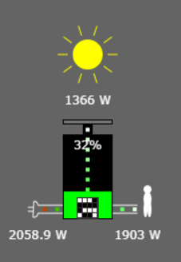  
   Figure 4-4

1) Settings for the entire cluster and display screens for energy sharing in progress  
   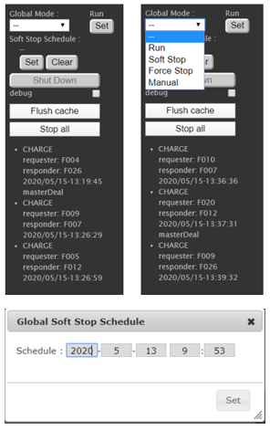  
   Figure 4-5  
    
   \[Global Mode settings\]  
   The “Global Mode:” item (upper left in Figure 4-5) can be used to set values for Operation Mode settings that affect the entire cluster. Clicking on the drop-down list below the title presents a list (upper right in Figure 4-5). The setting can be changed by selecting a energy sharing operating mode from the list and then clicking on the “Set” button to the right of the list. (For more information on the right side of the operation mode, refer to the apis-main specifications.)  
     
   \[Soft Stop Schedule setting\]  
   The “Soft Stop Schedule:” that is below the “Global Mode:” drop-down list can be used to set the timing for changing the energy sharing operation mode of the cluster to “Soft Stop” in advance. Clicking on the Set button below “Soft Stop Schedule:” displays a pop-up window for entering a schedule time (bottom of Figure 4-5). The schedule can be reset by clicking the “Clear” button to the right of the “Set” button.  
    
   \[Shut Down button\]  
   Clicking the “Shut Down” button that is below the “Soft Stop Schedule:” “Clear” button enables stopping of all of the apis-main instances in the cluster. However, this button is grayed-out and disabled unless “Global Mode:” is set to “Manual” and the energy sharing operation mode is “Manual”.  
    
   \[debug checkbox\]  
   If the “debug” checkbox below the “Shut Down” button is checked, more information is added to the individual node information for debugging. The additional information is explained in the following item (3), “Individual node information and control screen”.  
    
   \[Flush Cache button\]  
   When the “Flush Cache” button below the ‘debug’ checkbox is clicked, the Data Collector accesses the apis-web and updates the content of the cache written by Data Collector in the Main Controller.
    
   \[Stop all button\]
   When the “Stop all” button that is below the “Flush Cache” button is clicked, the DC/DC Converters of all nodes can be set to “Wait Mode”. This also stops all energy sharing that is in progress.
    
   \[Energy sharing data\]
   When the energy sharing transactions between nodes have been established, the transaction information is displayed as text under the “Stop all” button. The display is maintained until the transactions are completed.
    

1) Individual node information and control screen  
   Information for individual nodes, such as IP address and node name, is displayed. The operation mode can be set and the apis-main can be stopped. It is also possible to control the DC/DC converter of each node for debugging.  
   (The Grid Master node is highlighted in yellow, as shown on the left side of Figure 4-7 on the next page.)  
    
   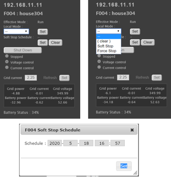  
   Figure 4-6  
    
   \[Effective Mode display\]  
   The “Effective Mode:” (left side of Figure 4-6) shows the energy sharing operation mode for individual nodes. The current energy sharing Operation Mode is determined by a combination of the “Global Mode:” and “Local Mode” settings.  
    
   \[Local Mode setting\]  
   The “Local Mode:”, which is below the “Effective Mode:”, can be used to set the energy sharing operation mode for individual nodes. Clicking on the drop-down list below it displays a list such as shown on the right side in Figure 4-6. The energy sharing operation mode can be changed by selecting a mode from the list and then clicking the “Set” button on the right side. (For more information on the energy sharing operation mode, refer to the apis-main specifications.)  
    
   \[Soft Stop Schedule setting\]  
   The “Soft Stop Schedule:” that is below the “Local Mode:” drop-down list can be used to set the timing for changing the energy sharing operation mode of the cluster to “Soft Stop” in advance. Clicking on the “Set” button below “Soft Stop Schedule:” displays a pop-up window for entering a schedule (bottom of Figure 4-6). The schedule setting can be reset by clicking the “Clear” button to the right of the “Set” button.  
    
   \[Shut Down button\]  
   Clicking the Shut Down button that is below the “Soft Stop Schedule:” “Clear” button enables stopping of the apis-main of the individual node. However, this button is grayed-out and disabled unless “Global Mode:” is set to “Manual” and the energy sharing operation mode is “Manual.”  
    
   \[DC/DC Converter Control setting\]  
    The parts in Figure 4-7 enclosed by broken lines and labeled (1) and (2) are the interfaces for managing the DC/DC Converter of each node. However, the controls are grayed-out and disabled unless the “Effective Mode:” is set to “Manual”.  
    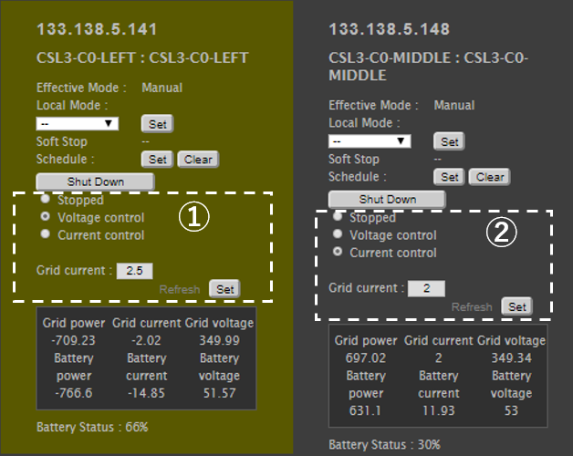  
    Figure 4-7

    The basic operation is described below.  
    * Operation
      * Changing the DC/DC Converter to Constant Voltage Mode (CV Mode)  
       Enter the value for “Grid current:” and then check “Voltage control” and click on the “Set” button. When operating in the CV Mode, the current value set for “Grid current:” is the setting for the maximum current for charging or discharging. To set the DC/DC Converter to Wait Mode, check “Stopped” and then click the “Set” button.
      * Changing the DC/DC Converter to Constant Current (CC Mode)  
       Enter the value for “Grid current:” and then check “Current control” and click on the “Set” button. Here, the value set for “Grid current:” is the value for current flow during actual energy sharing. The current setting value is relative to the battery, so it has a positive sign for charging and a negative sign for discharging. To set the DC/DC Converter to Wait Mode, check “Stopped” and then click the “Set” button in the same way as for the CV Mode. 
     For the manual operation described above, attention should be given to the points listed below.
    * Points to Note  
    1) Operation is from the CV Mode side.  
    2) For “Grid current:” on the CV Mode side, enter a value that is larger than the value set for “Grid current:” on the CC Mode side.  
    3) Operation is on the CC Mode side after the CV Mode voltage rise is complete and the DC Grid voltage has stabilized.  
    4) Stopping of energy sharing is an operation on the CC Mode side.  

    \[Power, current and voltage data\]  
    The information enclosed by the broken line in Figure 4-8 is the power, current, and voltage data for the DC grid and battery side acquired by sensors on the DC/DC Converter. The plus sign (+) indicates charging and the minus sign (-) indicates discharging.  
     
    \[Battery information\]  
    The “Battery Status:” just below the information enclosed by the broken line in Figure 4-8 displays the percent RSOC acquired from the battery.  
    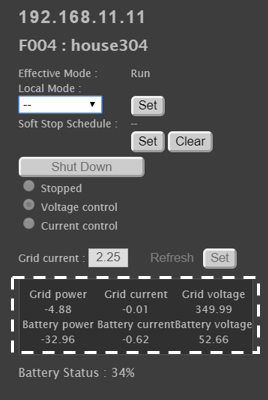  
    Figure 4-8  
     
    \[Debug information\]  
    If the “debug” checkbox has been checked as explained in item (2), “Settings for the entire cluster and display screens for energy sharing in progress”, the additional information on the individual node enclosed by the broken line in Figure 4-9 is displayed. However, the numerical values are not displayed if the data cannot be acquired because of the hardware configuration.  
    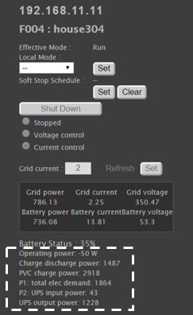  
    Figure 4-9

 

## **4.2. Controller module**
    
### **4.2.1. Bottle Web Server**

This Web server receives and processes Web API requests from the user and periodic requests from a JavaScript script in the display module. The JavaScript API requests trigger access to the apis-main Budo Emulator to obtain energy sharing data for the entire cluster or to schedule changes of the energy sharing Operation Mode. (For an explanation of the API available to users, see section 5.1, “User-Main Controller Web API”; for information on the Web API for accessing the Budo Emulator, see the relevant items in section 5.2, “Main Controller - apis-web Web API”; concerning the information that can be obtained from Budo Emulator, see “Budo Emulator/deals” in section 6.2.)

 

### **4.2.2. Data Collector**

Data Collector periodically accesses the apis-web Emulator Emulator via the Web API to obtain data specific to each node in the cluster and hardware information for storage in the Main Controller cache. (For information on the Web API for accessing the Emulator Emulator, see the relevant items in section 5.2, “Main Controller - apis-web Web API”; concerning the information that can be obtained from Emulator Emulator, see section 6.1, “Emulator Emulator/get/log”.)

 

### **4.2.3. Scheduler**

Scheduler periodically checks the energy sharing operation mode change file that is created in a specified folder by an operation such as “Soft Stop Schedule Setting”. It compares the date and time that is recorded in the file to the current date and time. If the value in the file is the same or earlier than the current date and time, the energy sharing operation mode is changed for the entire cluster.

 

# **5. Communication specifications**
    
## **5.1. User – Main Controller Web API**

The user can exchange information with Main Controller using the API described below.

<table>
<tbody>
<tr class="even">
<td>/</td>
<td>Energy sharing screen display</td>
</tr>
<tr class="odd">
<td>/get/logInfo</td>
<td>
Get data specific to each node in the cluster and information on hardware

(See section 6.1.1, “Node data collected from Main Controller by User”.)
</td>
</tr>
<tr class="even">
<td>/get/unit/&lt;oesid&gt;</td>
<td>
Get data specific to the specified node and hardware information

(See section 6.1.1, “Node data collected from Main Controller by User”.)
</td>
</tr>
<tr class="odd">
<td>/get/dcdc/&lt;oesid&gt;</td>
<td>
Get DC/DC Converter data for the specified node

(See section 6.1.1, “Node data collected from Main Controller by User”.)
</td>
</tr>
<tr class="even">
<td>/get/meter/&lt;oesid&gt;</td>
<td>
Get power data for the specified node

(See section 6.1.1, “Node data collected from Main Controller by User”.)
</td>
</tr>
<tr class="odd">
<td>/get/oesunit/&lt;oesid&gt;</td>
<td>
Get data specific to the specified node

(See section 6.1.1, “Node data collected from Main Controller by User”.)
</td>
</tr>
<tr class="even">
<td>/get/globalmode</td>
<td>Get the Global Operation Mode</td>
</tr>
<tr class="odd">
<td>/get/dealsInfo</td>
<td>
Get energy sharing information

(See section 6.1.2, “Energy sharing data collected from Main Controller by User”.)
</td>
</tr>
<tr class="even">
<td>/schedules</td>
<td>Get the current schedule information</td>
</tr>
<tr class="odd">
<td>/set/dcdc/&lt;oesid&gt;</td>
<td>Perform an operation on the DC/DC Converter of the specified node</td>
</tr>
<tr class="even">
<td>/set/budo/&lt;mode&gt;</td>
<td>
Global Operation Mode setting

&lt;mode&gt;

active: Normal energy sharing mode

quiet: Continue existing energy sharing and disable new energy sharing

stop: Energy sharing is stopped

manual: Manual mode (for debugging)
</td>
</tr>
<tr class="odd">
<td>/setOperationMode</td>
<td>Global or Local Operation Mode setting</td>
</tr>
<tr class="even">
<td>/setSchedule</td>
<td>Global or Local Operation Mode Schedule setting</td>
</tr>
<tr class="odd">
<td>/flushCache</td>
<td>Update the Data Collector write cache</td>
</tr>
<tr class="even">
<td>/stopAll</td>
<td>DC/DC Converter Forced Wait Mode setting for the entire cluster</td>
</tr>
<tr class="odd">
<td>/shutDown</td>
<td>Forced shutdown of apis-main for all nodes or individual nodes</td>
</tr>
<tr class="even">
<td>/ipv4</td>
<td>Get the IPv4 address of the Main Controller machine</td>
</tr>
<tr class="odd">
<td>/js/&lt;filename&gt;</td>
<td>Send the specified JavaScript that is in the ./js folder</td>
</tr>
<tr class="even">
<td>/img/&lt;filename&gt;</td>
<td>Send the specified image file that is in the ./img folder</td>
</tr>
<tr class="odd">
<td>
/CSS/images/

&lt;filename&gt;
</td>
<td>
Send the specified image file for CSS that is in the ./img folder.

(Image files are placed in the ./img folder when there is no ./CSS/img folder.)
</td>
</tr>
<tr class="even">
<td>/CSS/&lt;filename&gt;</td>
<td>Send the specified CSS file that is in the ./css folder.</td>
</tr>
<tr class="odd">
<td>/get/emu/&lt;oesid&gt;</td>
<td>
Get the Energy Management Unit (EMU) for the specified node

(Web API for use by the EMU installation system)
</td>
</tr>
<tr class="even">
<td>/upsMode/&lt;upsmode&gt;</td>
<td>
Change the UPS mode

(Web API for use by the UPS installation system)
</td>
</tr>
</tbody>
</table>

 

## **5.2. Main Controller - apis-web Web API**

Main Controller can exchange information with apis-web via the API described below.

<table>
<tbody>
<tr class="even">
<td rowspan="9">
Budo

Emulator
</td>
<td>/shutdown</td>
<td>Shutdown command for all nodes or individual nodes</td>
</tr>
<tr class="odd">
<td>/setOperationMode</td>
<td>Global or Local or Operation Mode setting</td>
</tr>
<tr class="even">
<td>/deals</td>
<td>
Get energy sharing information

(See section 6.2.2, “Energy sharing data collected from Budo Emulator by Main Controller”.)
</td>
</tr>
<tr class="odd">
<td>/unitIds</td>
<td>Get a list of node IDs</td>
</tr>
<tr class="even">
<td>/getStatus</td>
<td>Get the Global Operation Mode</td>
</tr>
<tr class="odd">
<td>/active</td>
<td>Global Operation Mode settings (Run)</td>
</tr>
<tr class="even">
<td>/quiet</td>
<td>Global Operation Mode settings (Soft stop)</td>
</tr>
<tr class="odd">
<td>/stop</td>
<td>Global Operation Mode settings (Force stop)</td>
</tr>
<tr class="even">
<td>/manual</td>
<td>Global Operation Mode settings (Manual)</td>
</tr>
<tr class="odd">
<td>
Emulator

Emulator
</td>
<td>/get/log</td>
<td>
Get hardware data such as DC/DC Converter and Battery RSOC for all nodes

(See section 6.2.1, “Energy sharing data collected from Budo Emulator by Main Controller”.)
</td>
</tr>
</tbody>
</table>

 

# **6. Information Collection**
    
## **6.1. Information collected from Main Controller by User**
        
### **6.1.1. Node data collected from Main Controller by User**

The node-specific information and hardware information that the user obtains for all nodes by issuing a “/get/log” Web API call to Main Controller is described below. This information is collected for all nodes as a single set. (The information that is available depends on the hardware environment.)

<table>
<tbody>
<tr class="even">
<td rowspan="5">apis</td>
<td>remaining_capacity_wh</td>
<td>Battery state of charge (Wh)</td>
</tr>
<tr class="odd">
<td>deal_interlock_capacity</td>
<td>The number of slots for which simultaneous interchange is possible when one interchange corresponds to one slot</td>
</tr>
<tr class="even">
<td>operation_mode.global</td>
<td>
Operation Mode setting for the entire cluster

autonomous: Normal energy sharing mode

heteronomous: Continue existing energy sharing. Disable new energy sharing generation.

stop: Stop energy sharing

manual: Manual mode (for evaluation)
</td>
</tr>
<tr class="odd">
<td>operation_mode.local</td>
<td>
Set the operation mode for this node

empty: operation_mode.global

heteronomous: Continue existing energy sharing. Disable new energy sharing generation

stop: Stop energy sharing
</td>
</tr>
<tr class="even">
<td>operation_mode.effective</td>
<td>
Effective Operation Mode

Defined by a combination of global and local operation modes
</td>
</tr>
<tr class="odd">
<td rowspan="10">oesunit</td>
<td>communityId</td>
<td>Community ID</td>
</tr>
<tr class="even">
<td>clusterId</td>
<td>Cluster ID</td>
</tr>
<tr class="odd">
<td>id</td>
<td>Node ID</td>
</tr>
<tr class="even">
<td>display</td>
<td>Node name</td>
</tr>
<tr class="odd">
<td>sn</td>
<td>Node serial number</td>
</tr>
<tr class="even">
<td>budo</td>
<td>
In the previous system, this was a flag that indicated the Active state for automatic interchange, but it is used in the current system as a flag to indicate that operation_mode.effective is “autonomous” or another state.

autonomous: 1

Other: 0
</td>
</tr>
<tr class="odd">
<td>ip</td>
<td>IPv4</td>
</tr>
<tr class="even">
<td>Ipv6_ll</td>
<td>IPv6 link local unicast</td>
</tr>
<tr class="odd">
<td>Ipv6_g</td>
<td>IPv6 global unicast</td>
</tr>
<tr class="even">
<td>mac</td>
<td>MAC address</td>
</tr>
<tr class="odd">
<td rowspan="2">battery</td>
<td>rsoc</td>
<td>Relative state of charge (%)</td>
</tr>
<tr class="even">
<td>battery_operation_status</td>
<td>A flag that indicates whether or not energy sharing is permitted</td>
</tr>
<tr class="odd">
<td colspan="2">time</td>
<td>apis-main node time</td>

</tr>
<tr class="even">
<td rowspan="21">dcdc</td>
<td>status.status</td>
<td>Status</td>
</tr>
<tr class="odd">
<td>status.alarm</td>
<td>Alarm number</td>
</tr>
<tr class="even">
<td>status.stateAlarm</td>
<td>Alarm information</td>
</tr>
<tr class="odd">
<td>status.statusName</td>
<td>DC/DC Converter status name</td>
</tr>
<tr class="even">
<td>status.runningState</td>
<td>DC/DC Converter operating status</td>
</tr>
<tr class="odd">
<td>status.operationMode</td>
<td>Operation Mode</td>
</tr>
<tr class="even">
<td>meter.wg</td>
<td>DC Grid power (W)</td>
</tr>
<tr class="odd">
<td>meter.vg</td>
<td>DC Grid voltage (V)</td>
</tr>
<tr class="even">
<td>meter.ig</td>
<td>DC Grid current (A)</td>
</tr>
<tr class="odd">
<td>meter.wb</td>
<td>Battery power (W)</td>
</tr>
<tr class="even">
<td>meter.vb</td>
<td>Battery voltage (V)</td>
</tr>
<tr class="odd">
<td>meter.ib</td>
<td>Battery current (A)</td>
</tr>
<tr class="even">
<td>meter.tmp</td>
<td>Internal temperature (°C)</td>
</tr>
<tr class="odd">
<td>vdis.dvg</td>
<td>DC Grid target voltage (V)</td>
</tr>
<tr class="even">
<td>vdis.drg</td>
<td>DC Grid Droop rate (%)</td>
</tr>
<tr class="odd">
<td>param.dig</td>
<td>DC Grid maximum current (A)</td>
</tr>
<tr class="even">
<td>param.ogv</td>
<td>DC Grid overvoltage threshold (V)</td>
</tr>
<tr class="odd">
<td>param.ugv</td>
<td>DC Grid low voltage threshold (V)</td>
</tr>
<tr class="even">
<td>param.cib</td>
<td>Battery maximum current (A)</td>
</tr>
<tr class="odd">
<td>param.obv</td>
<td>Battery overvoltage threshold (V)</td>
</tr>
<tr class="even">
<td>param.ubv</td>
<td>Battery low voltage threshold (V)</td>
</tr>
</tbody>
</table>

 

### **6.1.2. Energy sharing data collected from Main Controller by User**

The node-specific information and hardware information that the user obtains for all nodes by issuing a “/get/log” Web API call to Main Controller is described below. This information is collected for all nodes as a single set.

<table>
<tbody>
<tr class="even">
<td>isMasterDeal</td>
<td>Whether or not the energy sharing includes the CV mode</td>
</tr>
<tr class="odd">
<td>responder</td>
<td>ID of the node that accepted energy sharing</td>
</tr>
<tr class="even">
<td>request</td>
<td>Information that indicates whether the request is for charging or discharging</td>
</tr>
<tr class="odd">
<td>chargingUnit</td>
<td>ID of charging side node</td>
</tr>
<tr class="even">
<td>dischargingUnit</td>
<td>ID of discharging side node</td>
</tr>
<tr class="odd">
<td>startTime</td>
<td>Date and time of energy sharing start</td>
</tr>
<tr class="even">
<td>requester</td>
<td>ID of the node requesting energy sharing</td>
</tr>
</tbody>
</table>

 

## **6.2. Data collected from apis-web by Main Controller**
    
### **6.2.1. Node data collected from Emulator Emulator by Main Controller**

The node-specific information and hardware information that Main Controller obtains for all nodes by issuing a “/get/log” Web API call to the apis-web Emulator is described below. This information is collected for all nodes as a single set. (The information that is available depends on the hardware environment.)

<table>
<tbody>
<tr class="even">
<td rowspan="6">apis</td>
<td>version</td>
<td>apis-main version</td>
</tr>
<tr class="odd">
<td>remaining_capacity_wh</td>
<td>Battery state of charge (Wh)</td>
</tr>
<tr class="even">
<td>deal_interlock_capacity</td>
<td>The number of slots for which simultaneous interchange is possible when one interchange corresponds to one slot</td>
</tr>
<tr class="odd">
<td>operation_mode.global</td>
<td>
Operation Mode setting for the entire cluster

autonomous: Normal energy sharing mode

heteronomous: Continue existing energy sharing. Disable new energy sharing generation

stop: Stop energy sharing

manual: Manual mode (for evaluation)
</td>
</tr>
<tr class="even">
<td>operation_mode.local</td>
<td>
Set the operation mode for this node

empty: operation_mode.global

heteronomous: Continue existing energy sharing. Disable new energy sharing generation

stop: Stop energy sharing
</td>
</tr>
<tr class="odd">
<td>operation_mode.effective</td>
<td>
Effective Operation Mode

Defined by a combination of global and local operation modes
</td>
</tr>
<tr class="even">
<td rowspan="10">oesunit</td>
<td>communityId</td>
<td>Community ID</td>
</tr>
<tr class="odd">
<td>clusterId</td>
<td>Cluster ID</td>
</tr>
<tr class="even">
<td>id</td>
<td>Node ID</td>
</tr>
<tr class="odd">
<td>display</td>
<td>Node name</td>
</tr>
<tr class="even">
<td>sn</td>
<td>Node serial number</td>
</tr>
<tr class="odd">
<td>budo</td>
<td>
In the previous system, this was a flag that indicated the Active state for automatic interchange, but it is used in the current system as a flag to indicate that operation_mode.effective is “autonomous” or another state.

autonomous: 1

Other: 0
</td>
</tr>
<tr class="even">
<td>ip</td>
<td>IPv4</td>
</tr>
<tr class="odd">
<td>Ipv6_ll</td>
<td>IPv6 link local unicast</td>
</tr>
<tr class="even">
<td>Ipv6_g</td>
<td>IPv6 global unicast</td>
</tr>
<tr class="odd">
<td>mac</td>
<td>MAC address</td>
</tr>
<tr class="even">
<td rowspan="2">battery</td>
<td>rsoc</td>
<td>Relative state of charge (%)</td>
</tr>
<tr class="odd">
<td>battery_operation_status</td>
<td>A flag that indicates whether or not energy sharing is permitted</td>
</tr>
<tr class="even">
<td colspan="2">time</td>
<td>apis-main node time</td>
</tr>
<tr class="odd">
<td rowspan="21">dcdc</td>
<td>status.status</td>
<td>Status</td>
</tr>
<tr class="even">
<td>status.alarm</td>
<td>Alarm number</td>
</tr>
<tr class="odd">
<td>status.stateAlarm</td>
<td>Alarm information</td>
</tr>
<tr class="even">
<td>status.statusName</td>
<td>DC/DC Converter Status name</td>
</tr>
<tr class="odd">
<td>status.runningState</td>
<td>DC/DC Converter operating status</td>
</tr>
<tr class="even">
<td>status.operationMode</td>
<td>Operation Mode</td>
</tr>
<tr class="odd">
<td>meter.wg</td>
<td>DC Grid power (W)</td>
</tr>
<tr class="even">
<td>meter.vg</td>
<td>DC Grid voltage (V)</td>
</tr>
<tr class="odd">
<td>meter.ig</td>
<td>DC Grid current (A)</td>
</tr>
<tr class="even">
<td>meter.wb</td>
<td>Battery power (W)</td>
</tr>
<tr class="odd">
<td>meter.vb</td>
<td>Battery voltage (V)</td>
</tr>
<tr class="even">
<td>meter.ib</td>
<td>Battery current (A)</td>
</tr>
<tr class="odd">
<td>meter.tmp</td>
<td>Internal temperature (℃)</td>
</tr>
<tr class="even">
<td>vdis.dvg</td>
<td>DC Grid target voltage (V)</td>
</tr>
<tr class="odd">
<td>vdis.drg</td>
<td>DC Grid Droop rate (%)</td>
</tr>
<tr class="even">
<td>param.dig</td>
<td>DC Grid maximum current (A)</td>
</tr>
<tr class="odd">
<td>param.ogv</td>
<td>DC Grid overvoltage threshold (V)</td>
</tr>
<tr class="even">
<td>param.ugv</td>
<td>DC Grid low voltage threshold (V)</td>
</tr>
<tr class="odd">
<td>param.cib</td>
<td>Battery maximum current (A)</td>
</tr>
<tr class="even">
<td>param.obv</td>
<td>Battery overvoltage threshold (V)</td>
</tr>
<tr class="odd">
<td>param.ubv</td>
<td>Battery low voltage threshold (V)</td>
</tr>
</tbody>
</table>

 

### **6.2.2. Energy sharing data collected from Budo Emulator by Main Controller**

The energy sharing information that Main Controller obtains for all nodes by issuing a “/deals” Web API call to the apis-web Budo Emulator is described below. This information is collected as a single set for all energy sharing taking place at that time.

<table>
<tbody>
<tr class="even">
<td>unitId</td>
<td>Node ID</td>
</tr>
<tr class="odd">
<td>negotiationId</td>
<td>Energy sharing negotiation ID</td>
</tr>
<tr class="even">
<td>requestUnitId</td>
<td>ID of the node that requested energy sharing</td>
</tr>
<tr class="odd">
<td>acceptUnitId</td>
<td>ID of the node that accepted energy sharing</td>
</tr>
<tr class="even">
<td>requestDateTime</td>
<td>Date and time energy sharing was requested</td>
</tr>
<tr class="odd">
<td>acceptDateTime</td>
<td>Date and time energy sharing was accepted</td>
</tr>
<tr class="even">
<td>requestPointPerWh</td>
<td>Points per Wh presented by the requesting side</td>
</tr>
<tr class="odd">
<td>acceptPointPerWh</td>
<td>Points per Wh presented by the accepting side</td>
</tr>
<tr class="even">
<td>requestDealGridCurrentA</td>
<td>Interchange current presented by the requesting side</td>
</tr>
<tr class="odd">
<td>acceptDealGridCurrentA</td>
<td>Interchange current presented by the accepting side</td>
</tr>
<tr class="even">
<td>type</td>
<td>The type of energy sharing request (charge or discharge)</td>
</tr>
<tr class="odd">
<td>chargeUnitId</td>
<td>Charging side node ID</td>
</tr>
<tr class="even">
<td>dischargeUnitId</td>
<td>Discharging side node ID</td>
</tr>
<tr class="odd">
<td>pointPerWh</td>
<td>Points per Wh for the actual energy sharing</td>
</tr>
<tr class="even">
<td>chargeUnitEfficientGridVoltageV</td>
<td>Efficient DC Grid voltage for the charging node</td>
</tr>
<tr class="odd">
<td>dischargeUnitEfficientGridVoltageV</td>
<td>Efficient DC Grid voltage for the discharging node</td>
</tr>
<tr class="even">
<td>dealGridCurrentA</td>
<td>Current for the energy sharing (A)</td>
</tr>
<tr class="odd">
<td>requestAmountWh</td>
<td>Power presented by the requesting side</td>
</tr>
<tr class="even">
<td>acceptAmountWh</td>
<td>Energy presented by the accepting side</td>
</tr>
<tr class="odd">
<td>dealAmountWh</td>
<td>Energy for the energy sharing (Wh)</td>
</tr>
<tr class="even">
<td>dealId</td>
<td>ID assigned to the energy sharing</td>
</tr>
<tr class="odd">
<td>createDateTime</td>
<td>Date and time the energy sharing information for the energy sharing was created</td>
</tr>
<tr class="even">
<td>
compensationTargetVoltage

ReferenceGridCurrentA
</td>
<td>Target value for current compensation of the node that serves as the voltage reference (A)</td>
</tr>
<tr class="odd">
<td>activateDateTime</td>
<td>Date and time for start-up on the constant voltage node side</td>
</tr>
<tr class="even">
<td>rampUpDateTime</td>
<td>Date and time for completion of the DC grid voltage ramp up</td>
</tr>
<tr class="odd">
<td>warmUpDateTime</td>
<td>Date and time for start-up on the constant current node side</td>
</tr>
<tr class="even">
<td>
dischargeUnitCompensated

GridCurrentA
</td>
<td>Discharge current after current compensation (A)</td>
</tr>
<tr class="odd">
<td>
chargeUnitCompensated

GridCurrentA
</td>
<td>Charge current after current compensation (A)</td>
</tr>
<tr class="even">
<td>startDateTime</td>
<td>Date and time the energy sharing began</td>
</tr>
<tr class="odd">
<td>cumulateDateTime</td>
<td>Date and time for the accumulated power of the energy sharing</td>
</tr>
<tr class="even">
<td>cumulateAmountWh</td>
<td>Total energy of the energy sharing (Wh)</td>
</tr>
<tr class="odd">
<td>stopDateTime</td>
<td>Date and time the energy sharing ended</td>
</tr>
<tr class="even">
<td>deactiveateDateTime</td>
<td>Date and time the processing was completed after the energy sharing</td>
</tr>
</tbody>
</table>

 

# **7. Configuration file**

## **7.1. startMain.py**

The parameters used by Main Controller are not independent in the form of a configuration file, but are specified as variables in the startMain.py file. Also, there are some parameters that are not used for APIS, because Main Controller is assumed to be used together with the previous system.

<table>
<tbody>
<tr class="even">
<td>b_host</td>
<td>Bottle Web Server IP Address</td>
</tr>
<tr class="odd">
<td>b_port</td>
<td>Bottle Web Server Port number</td>
</tr>
<tr class="even">
<td>emul_port</td>
<td>Former Emulator port number, Port = 4390</td>
</tr>
<tr class="odd">
<td>budo_port</td>
<td>Former Budo port number, Port = 4383</td>
</tr>
<tr class="even">
<td>emulator</td>
<td>
Whether or not the emulator should be used as the power system rather than the actual machine

(Set to True or False)
</td>
</tr>
<tr class="odd">
<td>apis</td>
<td>
Whether or not Main Controller should be used as APIS

(Set to True or False; for APIS, it is set to True)
</td>
</tr>
<tr class="even">
<td>apis_host</td>
<td>apis-web IP Address</td>
</tr>
<tr class="odd">
<td>apis_emul_port</td>
<td>apis-web Emulator Emulator port number, Port = 43900</td>
</tr>
<tr class="even">
<td>apis_budo_port</td>
<td>apis-web Budo Emulator port number, Port = 43830</td>
</tr>
<tr class="odd">
<td>apis_emul_url</td>
<td>apis-web Emulator Emulator URL</td>
</tr>
<tr class="even">
<td>apis_budo_url</td>
<td>apis-web Budo Emulator URL</td>
</tr>
<tr class="odd">
<td>ups_set_url</td>
<td>UPS installation system URL</td>
</tr>
<tr class="even">
<td>set_url</td>
<td>
DC/DC Converter control URL

(The appropriate device driver port number and Web API must be set.)
</td>
</tr>
<tr class="odd">
<td>url</td>
<td>
URL for getting information on DC/DC Converter, EMU, etc.

(The appropriate device driver port number and Web API must be set.)
</td>
</tr>
<tr class="even">
<td>emul_url</td>
<td>URL for Emulator of the previous system</td>
</tr>
<tr class="odd">
<td>budo_url</td>
<td>URL for Budo of the previous system (APIS not used)</td>
</tr>
<tr class="even">
<td>datacollectorinterval</td>
<td>Setting of the interval for accessing the Data Collector Emulator Emulator (seconds)</td>
</tr>
<tr class="odd">
<td>schedulerInterval</td>
<td>Setting of the interval for accessing the schedule file of Scheduler (seconds)</td>
</tr>
</tbody>
</table>

 

## **7.2. logging.conf**

Main Controller uses the logging.config.fileConfig() function to initialize Logger. That function initializes Logger by reading the settings from logging.conf at start-up.

<table>
<tbody>
<tr class="even">
<td>loggers</td>
<td>keys: Logger instance name description</td>
</tr>
<tr class="odd">
<td>handlers</td>
<td>keys: Handler instance name description</td>
</tr>
<tr class="even">
<td>formatters</td>
<td>keys: Formatter instance name description</td>
</tr>
<tr class="odd">
<td>loger_root</td>
<td>
level: Specifies the message output level

handlers: Applicable handler instance name description
</td>
</tr>
<tr class="even">
<td>
handler_consoleHandler

handler_infoFileHandler
</td>
<td>
class: Specifies the implemented Handler class

-StreamHandler: Outputs the specified stream

-FileHandler: Outputs the specified file

level: Messages of the specified output level or higher are output

formatter: Specifies the Formatter to be used when messages are output

args: The arguments to be used for instantiating the Handler class

　　 Settings for the log output destination and log file storage folder
</td>
</tr>
<tr class="odd">
<td>
formatter_consoleFormatter

formatter_infoFileFormatter
</td>
<td>
format: Specification of various formats

datefmt: Specification of the date-time format
</td>
</tr>
</tbody>
</table>

 

# **8. Log output**
    
## **8.1. Log Level**

Log output uses the Python “logging” standard library module, which has the five output levels described below. The “critical” level is not used for Main Controller. The destination for log output, the location of the folder in which log files are saved, and the log level for output or saving are specified as settings in the logging.conf file.

\[Level\]  
1.  CRITICAL  
   → Indicates that a fatal problem has occurred; However, this level is not output for Main Controller.

1.  ERROR  
   → Indicates that a problem has occurred during execution.  
   \<Example\> Output when an HTTP communication error occurs or an unsupported Web API call is made.

1.  WARNING  
   → Used for alert notifications.
   \<Example\> When a Wait instruction has been issued manually to the DC/DC Converters of all nodes by a /stopAll Web API call, etc.

1.  INFO  
   → Used to output information on a normally-operating system.  
   \<Example\> Information on the called Web API and Web API execution completed log, etc.

1.  DEBUG  
   → Information used for debugging.  
   \<Example\> Log that notifies of Main Controller start-up or Web API processing in progress, etc.

 

## **8.2. Log output destination**

Main Controller logs are output to two destinations: console and file. The log output destinations can be enabled or disabled and the log output level (see section 8.1 above) can be restricted by changing the settings in the logging.conf file.

 

# **9. Handling of abnormalities**

A log is output to the console and to a file when an abnormality occurs, but there is no function for the system to reset or stop itself.

 

# **10. Security**
    
## **10.1. Security of User-Main Controller communication**

Communication between the user and Grid Master is not secure, so Web server configuration for restricting IP address access may be necessary.

 

## **10.2. Security of Main Controller-apis-web communication**

Communication between Grid Master and apis-web is not secure, so Web server configuration for restricting IP address access may be necessary.

 

# **11. Privacy**

Personal information must be handled with care because the act of sending personal information to an external server without permission from the owner may be subject to the General Data Production Regulation (GDPR) and other regulations that protect personal information. Whether or not information that can be obtained by the Web API is considered personal information depends on the geographic region in which Main Controller is deployed, so confirmation is necessary.

 

# **12. OSS licensing**

The software used by Main Controller and the corresponding OSS license information are described below.

■ Main Controller software and licensing information
<table>
<thead>
<tr class="header">
<th>Software</th>
<th>Version</th>
<th>License</th>
<th>Code Change</th>
</tr>
</thead>
<tbody>
<tr class="odd">
<td>Python</td>
<td>3.6.9</td>
<td>PSL License</td>
<td>None</td>
</tr>
<tr class="even">
<td>netifacces</td>
<td>0.10.9</td>
<td>MIT License</td>
<td>None</td>
</tr>
<tr class="odd">
<td>requests</td>
<td>2.24.0</td>
<td>Apache License2.0</td>
<td>None</td>
</tr>
<tr class="even">
<td>bottle</td>
<td>0.12.8</td>
<td>MIT License</td>
<td>None</td>
</tr>
<tr class="odd">
<td>pytz</td>
<td>2020.1</td>
<td>MIT License</td>
<td>None</td>
</tr>
<tr class="even">
<td>wheel</td>
<td>0.30.0</td>
<td>MIT License</td>
<td>None</td>
</tr>
<tr class="odd">
<td>jQuery</td>
<td>1.7.2</td>
<td>
MIT License or GPL v2 License

(selectable)
</td>
<td>None</td>
</tr>
<tr class="even">
<td>jQuery UI</td>
<td>1.8.19</td>
<td>
MIT Licenser or GPLv2 License

(selectable)
</td>
<td>None</td>
</tr>
</tbody>
</table>
\*Software versions may change.

   

# **13. Tips**

The user accesses Main Controller via a Web browser. Files for jQuery and jQuery-ui, JavaScript, and CSS are needed to construct the Main Controller display screen in the browser, and the browser must download the required files via the Internet to display the screen. Therefore, an Internet connection is required for access to Main Controller. As a result, Main Controller cannot be used in locations where Internet access is not possible, such as in areas where electricity is not available or in experimental facilities. To address that problem, the required files should be downloaded in advance and saved in the Main Controller for use.

\[Solution\]

1.  Save the file [https://code.jquery.com/jquery-1.7.2.js](https://code.jquery.com/jquery-1.7.2.js) as “jquery.js” in the folder “main\_controller/js/”.

2.  Save the file [https://code.jquery.com/ui/1.8.19/jquery-ui.js](https://code.jquery.com/ui/1.8.19/jquery-ui.js) as “jquery-ui.js” in the folder “main\_controller/js/”.

3.  Save the file [https://code.jquery.com/ui/1.12.1/themes/base/jquery-ui.css](https://code.jquery.com/ui/1.12.1/themes/base/jquery-ui.css) as “jquery-ui.css” in the folder “main\_controller/css/”.

4.  Rewrite the following parts of the file “main\_controller/views/main.tpl”.  
       * 4-1.  Rewrite jquery.js  
        \<script src="[https://code.jquery.com/jquery-1.7.2.js](https://code.jquery.com/jquery-1.7.2.js)"crossorigin="anonymous"\>\</script\>  
        &emsp;&emsp;&emsp;↓Rewrite to:  
        \<script src="./js/jquery.js" type="text/javascript"\>  
       * 4-2.  Rewrite jquery-ui.js  
        \<script src="[https://code.jquery.com/ui/1.8.19/jquery-ui.js](https://code.jquery.com/ui/1.8.19/jquery-ui.js)"crossorigin="anonymous"\>\</script\>  
        &emsp;&emsp;&emsp;↓Rewrite to:  
        \<script src="./js/jquery-ui.js" type="text/javascript"\>\</script\>  
       * 4-3. Rewrite jquery-ui.css  
        \<link rel="stylesheet" type="text/css"href="[https://code.jquery.com/ui/1.12.1/themes/base/jquery-ui.css](https://code.jquery.com/ui/1.12.1/themes/base/jquery-ui.css)"\>  
        &emsp;&emsp;&emsp;↓Rewrite to:  
        \<link rel="stylesheet" type="text/css" href="./css/jquery-ui.css"\>  

    

***
