**apis-main-controller仕様書**
====================
**Rev 0.71**

**目次**
========

[1.用語・略語](#anchor1)

[2.概要](#anchor2)

[3.ソフトウェア構成](#anchor3)

[3.1. ソフトウェア概要](#anchor3-1)

[3.2.ソフトウェア接続構成](#anchor3-2)

[4.機能説明](#anchor4)

[4.1.表示部](#anchor4-1)

[4.2.制御部](#anchor4-2)

[4.2.1.Bottle Web Server](#anchor4-2-1)

[4.2.2.Data Collector](#anchor4-2-2)

[4.2.3.Scheduler](#anchor4-2-3)

[5.通信仕様](#anchor5)

[5.1.User – Main Controller間Web API](#anchor5-1)

[5.2.Main Controller - apis-web 間Web API](#anchor5-2)

[6.収集情報](#anchor6)

[6.1.UserがMain Controllerから収集する情報](#anchor6-1)

[6.1.1.UserがMain Controllerから収集するノード情報](#anchor6-1-1)

[6.1.2.UserがMain Controllerから収集する電力融通情報](#anchor6-1-2)

[6.2.Main Controller がapis-webから収集する情報](#anchor6-2)

[6.2.1.Main ControllerがEmulator Emulatorから収集するノード情報](#anchor6-2-1)

[6.2.2.Main ControllerがBudo Emulatorから収集する電力融通情報](#anchor6-2-2)

[7.設定ファイルについて](#anchor7)

[7.1.startMain.py](#anchor7-1)

[7.2.logging.conf](#anchor7-2)

[8.Log出力](#anchor8)

[8.1.Log Level](#anchor8-1)

[8.2.Log出力先](#anchor8-2)

[9.異常処理](#anchor9)

[10.セキュリティ](#anchor10)

[10.1.User-Main Controller間通信セキュリティ](#anchor10-1)

[10.2.Main Controller-apis-web間通信セキュリティ](#anchor10-2)

[11.プライバシー](#anchor11)

[12.OSSライセンス](#anchor12)

[13.Tips](#anchor13)

**1.用語・略語**
==============

<table><thead><tr class="header"><td><strong>用語</strong></td><td><strong>説明</strong></td></tr></thead><tbody><tr class="odd"><td>apis-main</td><td>
自律分散制御を可能にする電力相互融通ソフトウェアである。

(詳細はapis-main仕様書を参照。)
</td></tr><tr class="even"><td>apis-web</td><td>apis-mainがインストールされた各ノードの固有情報や、ノード間の電力融通に関わる情報をMain Controllerへ提供するソフトウェアである。(詳細はapis-web仕様書を参照。)</td></tr><tr class="odd"><td>Budo Emulator</td><td>apis-web内のServiceであり、Main Controllerに対してapis-main間の電力融通情報を提供し、apis-mainの全ノード及び個別ノードに対して電力融通の実行/停止等の設定変更を行うことができる。 “Emulator”という名称は、自律分散制御であるapis-main開発以前の集中管理制御の自動電力融ソフトウェアであるBudoの情報提供を模倣する機能であることから付けられている。</td></tr><tr class="even"><td>Emulator Emulator</td><td>apis-web内のServiceであり、Main Controllerに対して、各apis-main固有の情報やDC/DC Converter、Battery等のハードウェア情報を提供する。“Emulator Emulator”の名称はこのServiceを開発する際に、既に開発されていたDC/DCD ConverterやBattery等のハードウェアEmulatorが持つWeb APIを流用したことによりEmulatorを模すServiceになったことからEmulator Emulatorと付けられた。</td></tr><tr class="odd"><td>Grid Master</td><td>apis-mainに含まれるServiceの名称でDC Gridを制御し電力融通を実現する。</td></tr><tr class="even"><td>Mediator</td><td>apis-mainに含まれるServiceの名称で他のapis-mainとネゴシエーションを行って電力融通取引情報を作成する。必要に応じてGrid Masterを起動させる役割も担う。</td></tr><tr class="odd"><td>Hazelcast</td><td>複数のマシンにDataを分散し並列処理を行うことでアプリケーションを高速化するインメモリ分散コンピューティング運用ライブラリである。</td></tr><tr class="even"><td>Vert.x</td><td>負荷分散プログラムのフレームワーク。Hazelcastライブラリを利用してEvent Busをクラスタ化しネットワーク上で負荷分散処理を行う。</td></tr><tr class="odd"><td>Event Bus</td><td>apis-main等で負荷分散のフレームワークとして使われるVert.xのプログラムの最小単位をVerticleと呼び、そのVerticle間でお互いに通信するための非同期インターフェースをEvent Busと呼ぶ</td></tr></tbody></table>

**2.概要**
========

Main Controllerはapis-mainがインストールされた各ノードの状態や電力融通の状況をリアルタイムに表示するWebアプリケーションである。表示に必要な情報はapis-webが提供するWeb APIを経由して取得する。また、運用及びDebug用としてクラスタの電力融通Operation Modeを変更したり、各ノードのDC/DC Converterを個別に制御し電力融通を実施させたりすることも可能である。

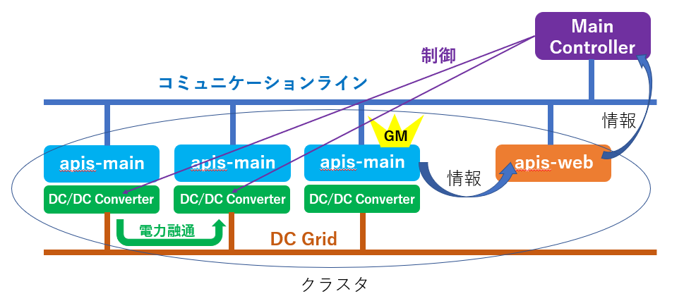

**3.ソフトウェア構成**
====================

**3.1.ソフトウェア概要**
-----------------------

Main Controllerのソフトウェア構成としては以下の図3-1で示すように大まかに表示部と制御部に分けることができる。表示部に関しては標準的な構成ではあるが、TPLテンプレートでWebコンテンツの構造を作成し、CSSにて飾り付けを行ってJavaScriptで画面に動きを持たせている。制御部に関してはWebアプリケーション作成用フレームワークであるPython Bottleを採用し、Bottle Web Server、Data Collector、Schedulerの 3つのServiceで構成されている。

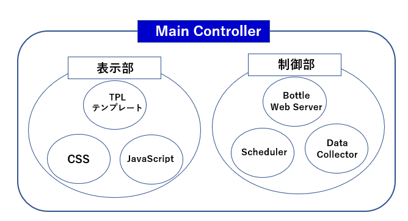

**3.2.ソフトウェア接続構成**
------------------------

Main Controllerのソフトウェア接続構成を以下の図3-2に示す。UserがMain ControllerへHTTPアクセスを行うと制御部のBottle Web Serverがそのリクエストを受け取る。UserからのリクエストがMain Controllerの画面表示だった場合には表示部のTPLテンプレート、CSS、JavaScriptがUser側のブラウザにダウンロードされて画面を表示し、画面表示ではないリクエストの場合にはBottle Web Serverが必要な情報を集めてUserへ返信する。制御部のData Collectorは定期的にapis-webのEmulator Emulatorにアクセスをしてapis-mainが起動する全ノードの情報を取得しMain Controller内のCacheに保存する。Cacheに保存された全ノードの情報は表示部のJavaScriptが定期的にBottle Web ServerにHTTPアクセスしてBottle Web ServerがCacheから取得することでJavaScriptに渡される。また、JavaScriptは定期的にBottle Web ServerにHTTPアクセスをしてBottle Web Server経由でapis-webのBudo Emulatorから全電力融通情報を取得する。JavaScriptは定期的に取得した全ノードの情報及び電力融通情報を元にUserのブラウザ画面の表示を変える。制御部のSchedulerはapis-mainの電力融通ModeのScheduleの管理を行う。例えばメンテナンス作業があり、次の日の正午までに電力融通を停止させたい場合等は、Schedulerに電力融通停止日時を設定することでメンテナンス前に電力融通を停止させることができる。

　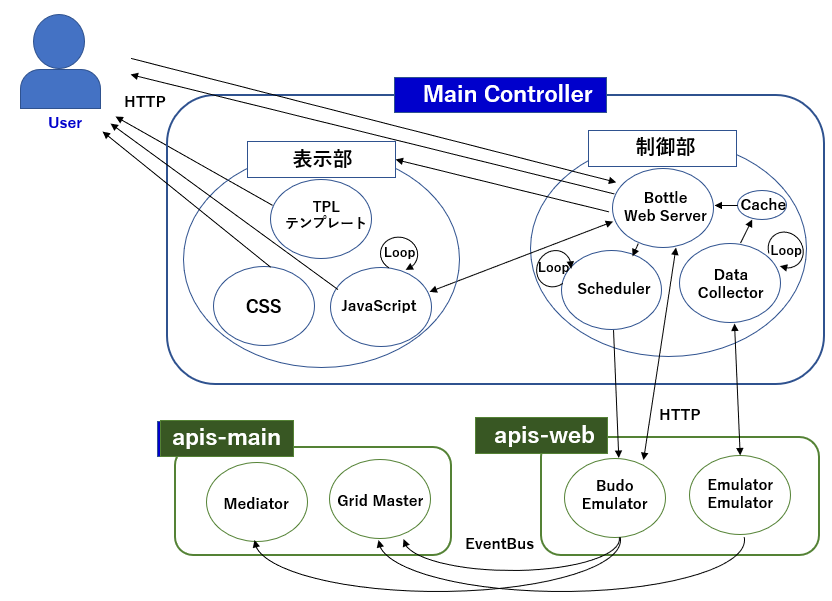

**4.機能説明**
==============

**4.1.表示部**
----------

図4-1にMain Controllerのメイン画面を示す。 ①の点線で囲われたブロックは現在進行中の電力融通の状況について表示し、②はクラスタ全体に関わる設定や進行中の電力融通の情報について表示しており、そして③は各ノードの個別情報及び各ノードのDC/DC Converterの制御画面を表示している。それぞれについてブロック毎に説明する。

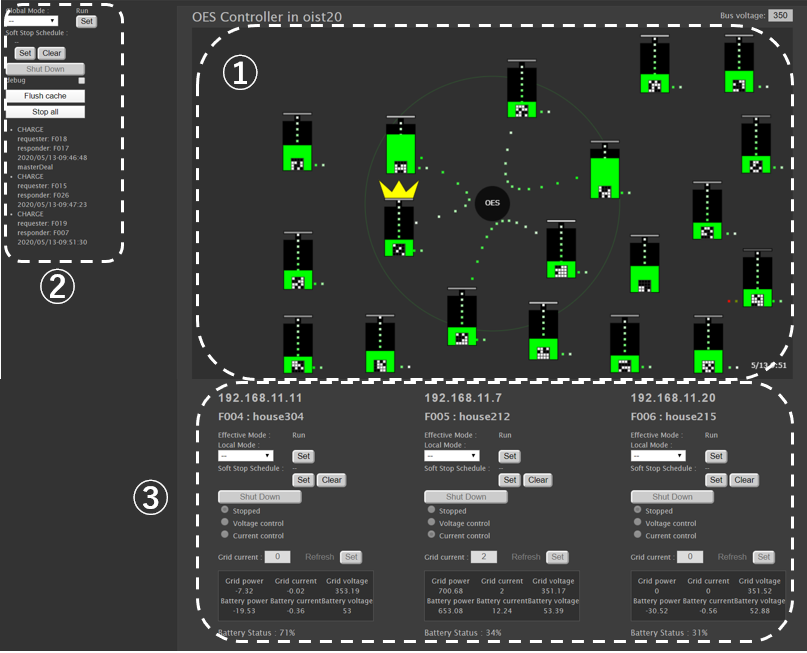

1.  電力融通画面　　　　　　　　　　　　　　　　　

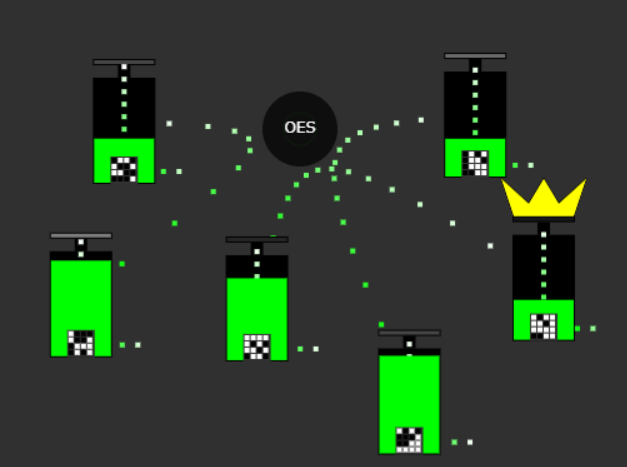
apis-mainがインストールされた各ノードを長方形のボックスで表現する。電力融通が行われる際には、電力融通を行うノード同士が画面中央に近づき、ボックス間をドット線で結ぶことで電力融通が行われている様子を表す。ボックスの上に表示された黄色の王冠マークはそのノードのDC/DC ConverterがConstant Voltage Mode(CV Mode)で動作していることを表している。
(電力融通の詳細に関しては apis-main仕様書を参考すること。)

　　

図4-3は各ノードのボックスを切り出した図である。
上からのドットの線は太陽光発電からの電力供給を左のドットの線は電力系統からの電力供給を、そして右のドット線はノードの電力消費を表している。
緑色の表示はBatteryの残容量を表しており、Batteryの　残容量によって緑の面積が増減し視覚的に分かりやすく表示される。

　　
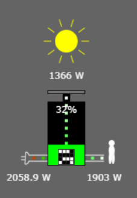 
各ノードのボックスをマウスでクリックすると図4-4のように、そのノードの電力に関する詳細情報が
表示される。(電力に関する詳細情報と同時に各ノードの太陽光発電の発電状況や、電力融通の状況、
Battery残容量の変化などの履歴表示用の枠が表示されるが、Main Controller単体では履歴表示を行う機能はない。）

2.  クラスタ全体に関わる設定及び進行中の電力融通情報表示画面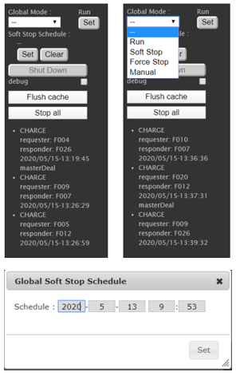

\[Global Mode設定\]  
図4-5の左上図中の”Global Mode:”はクラスタ全体に関わる電力融通Operation Modeの設定を行うことができる。下のドロップダウンリストをマウスでクリックすると図4-5の右上図のようにリストが表示され、その中から設定する電力融通Operation Modeを選択後、横の”Set”ボタンを押下することによってクラスタ内の電力融通Operation Modeを変更することができる。(電力融通Operation Modeについての詳細はapis-main仕様書を参照すること。)

 \[Soft Stop Schedule設定\]  
“Global Mode :”のドロップダウンリストの下の “Soft Stop Schedule:”は予め日時を設定することで、そのタイミングでクラスタの電力融通
Operation ModeをSoft Stopに変更することができる。”Soft Stop Schedule:”の ”Set”ボタンを押下すると図4-5の下図のようにScheduleを入力する画面がポップアップする。
設定したScheduleは”Set”ボタン右横の”Clear”ボタンを押下することで設定内容をリセットすることができる。

\[Shut Downボタン\]  
“Soft Stop Schedule :“ の”Clear”ボタンの下の”Shut Down”ボタンを押下するとクラスタ内の全apis-mainを停止させることができる。ただし、”Global Mode:”で”Manual”を選択し、電力融通Operation Modeが”Manual“でない場合はボタン自体がグレーアウトされて操作することができない。

\[debugチェックボックス\]  
 “Shut Down”ボタンの下の“debug”チェックボックスにチェックを入れるとDebug用として個別ノード情報に追加情報を付与する。追加情報の詳細は次の③個別ノード情報及び制御画面にて説明する。

\[Flush Cacheボタン\]  
“debug”チェックボックスの下の”Flush Cache”ボタンを押下するとData Collectorはapis-webにアクセスしMain Controller内のData Collectorが書き込むCache内の情報をUpdateする。

\[Stop allボタン\]  
“Flush Cache”ボタンの下の”Stop all” ボタンを押下すると全ノードのDC/DC ConverterをWait Modeに設定することができる。このボタンを押下すると現在進行中の電力融通も停止する。

\[電力融通情報\]  
各ノード間で電力融通取引が成立すると“Stop all”ボタンの下に電力融通取引情報がテキスト表示される。この情報は電力融通取引が完了するまで表示される。

3.  個別ノード情報及び制御画面

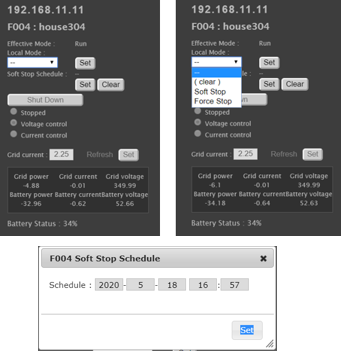
個別ノードのIPアドレスやノード名称などの情報が表示され、個別ノードに対する電力融通OperationModeの設定及び、apis-mainの停止を行うことができる。また、Debug用に個別ノードのDC/DC Converterの制御を行うことができる。
(Grid Masterのノードは次ページの図4-7の左図のように黄色にハイライトされる。)　　

\[Effective Mode表示\]  
図4-6の左図中の”Effective Mode:”は個別ノードの現在の電力融通Operation Modeを示す。現在の電力融通Operation Modeは”Global Mode:” と”Local Mode” で設定された電力融通Operation Modeの組み合わせにて決定される。

\[Local Mode設定\]
“Effective Mode:”の下の”Local Mode:”は個別ノードに関わる電力融通Operation Modeの設定を行うことができる。下のドロップダウンリストをマウスでクリックすると図4-6の右図のようにリストが表示され、その中から設定する電力融通Operation Modeを選択後、横の”Set”ボタンを押下することによって個別ノードの電力融通Operation Modeを変更することができる。(電力融通Operation Modeについての詳細はapis-main仕様書を参照すること。)

\[Soft Stop Schedule設定\]
“Local Mode :”のドロップダウンリストの下の “Soft Stop Schedule:”は予め日時を設定することで、そのタイミングで個別ノードの電力融通Operation ModeをSoft Stopに変更することができる。”Soft Stop Schedule:”の ”Set”ボタンを押下すると図4-6の下図のようにScheduleを入力する画面がポップアップする。設定したScheduleは”Set”ボタン右横の”Clear”ボタンを押下することで設定内容を消すことができる。

\[Shut Downボタン\]
“Soft Stop Schedule :“ の”Clear”ボタンの下の”Shut Down”ボタンを押下すると個別ノードのapis-mainを停止させることができる。ただし、”Global Mode:”で”Manual”を選択し、電力融通Modeが”Manual“でない場合はボタン自体がグレーアウトされて操作することができない。

\[DC/DC Converter Control設定\]
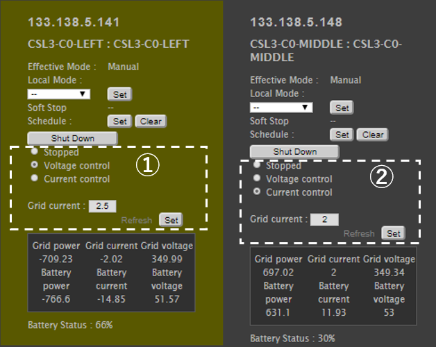
右の図4-7の点線で囲まれた①、②は各ノードのDC/DC Converterを操作するためのインターフェースである。ただし”Effective Mode:”が”Manual”以外はグレーアウトされて操作することができない。

以下に基本操作を説明する。

▼操作  
・DC/DC ConverterのModeをConstant Voltage Mode (CV Mode)に変更する場合  
”Grid current: ”に電流値を入力後“Voltage control”にチェックを入れて”Set”ボタンを押下する。CV Modeで”Grid current :”に設定する電流値はCV Modeとして充放電可能な最大電流値の設定となる。DC/DC ConverterをWait Modeにする場合には”Stopped“にチェックを入れて”Set”ボタンを押下する。

・DC/DC ConverterのModeをConstant Current (CC Mode)に変更する場合  
”Grid current: ”に電流値入力後“Current control”にチェックを入れて”Set”ボタンを押下する。ここで”Grid current:”に設定する電流値は実際に電力を融通する際に流す電流値である。電流の設定値はBattery視点なので充電する場合は”+”、放電する場合は”-“を値に付けて入力する。CV Mode同様にDC/DC ConverterをWait Modeにする場合には”Stopped“にチェックを入れて”Set”ボタンを押下する。
上記のManual操作にて電力融通を行う方法に関して以下に注意点を上げる。

▼注意点  
(1)CV Mode側から操作する。  
(2)CV Mode側の”Grid current:”の電流値はCC Mode側の”Grid current:”より大きな値を入力する。  
(3)CV Modeの電圧が完全に立ち上がってDC Grid電圧が安定した後にCC Mode側を操作する。  
(4)電力融通を停止する場合はCC Mode側から操作する。  
　　\[電力/電流/電圧情報\]
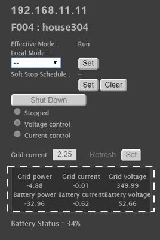 
右図4-8の点線で囲まれた情報はDC/DC Converter上のセンサによって取得されたDC Grid側とBattery側の電力/電流/電圧の情報である。”+”は充電、”-”は放電を示す。

\[Battery情報 \]  
右図4-8の点線で囲まれた情報の下の”Battery Status:”はBatteryから取得したRSOC値を%で表示している。

\[Debug情報\]  
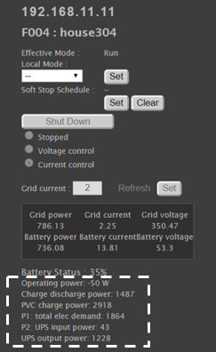
“②クラスタ全体に関わる設定及び進行中の電力融通情報表示画面”で説明した”debug”チェックボックスにチェックを入れるとDebug用として図4-9の点線のように個別ノードの情報を追加する。ただし、ハードウェア構成によって該当する情報が取得できない場合には数値は表示されない。

**4.2制御部**
----------

**4.2.1.Bottle Web Server**  
このServiceはUserもしくは表示部のJavaScriptからの定期的なWeb APIリクエストを受け取って処理を行うWeb Serverである。JavaScriptからの定期的なアクセスをTriggerとしてapis-webのBudo EmulatorへWeb API アクセスを行ってクラスタ内の全電力融通情報を取得したり、電力融通Operation Modeを変更するためのScheduleを設定したりすることができる。(Userから利用可能なWeb APIは”5.1 User-Main Controller間Web API” 参照、また、Budo Emulatorに対して発行可能なWeb APIは”5.2 Main Controller-apis-web間Web API” の対Budo Emulatorの項目参照、また、Budo Emulatorから取得可能な情報は”6.2 Budo Emulator /deals”参照)

**4.2.2.Data Collector**  
このServiceはapis-webのEmulator Emulatorに対して定期的にWeb APIアクセスを行ってクラスタ内の全ノードの固有情報及びハードウェア情報を取得しMain Controller内のCacheに保存する。(Emulator Emulatorに対して発行可能なWeb APIは”5.2 Main Controller-apis-web間Web API” の対Emulator Emulatorの項目参照、またEmulator Emulatorから取得可能な情報は”6.1 Emulator Emulator /get/log”参照)

**4.2.3Scheduler**  
このServiceは“Soft Stop Schedule設定“等の操作によって指定フォルダに作られた電力融通Operation Mode変更スケジュールファイルを定期的にチェックし現在の日時と比較する。設定された日時と同じかそれより過ぎていた場合にはクラスタ内の電力融通Operation Modeを変更する。  

**5.通信仕様**
============

**5.1.User – Main Controller間Web API**
-----------------------------------

Userは下記のWeb APIにてMain Controllerと情報のやり取りを行うことができる。以下にそのWeb APIの仕様を説明する。

<table><thead><tr class="header"><td>/</td><td>電力融通画面表示</td></tr></thead><tbody><tr class="odd"><td>/get/logInfo</td><td>
クラスタ内全ノード固有情報&amp;ハードウェア情報取得

( ”6.1.1 UserがMain Controllerから収集するノード情報”参照)
</td></tr><tr class="even"><td>/get/unit/&lt;oesid&gt;</td><td>
指定ノード固有情報&amp;ハードウェア情報取得

( ”6.1.1 UserがMain Controllerから収集するノード情報”参照)
</td></tr><tr class="odd"><td>/get/dcdc/&lt;oesid&gt;</td><td>
指定ノードDC/DC Converter情報取得

( ”6.1.1 UserがMain Controllerから収集するノード情報”参照)
</td></tr><tr class="even"><td>/get/meter/&lt;oesid&gt;</td><td>
指定ノード電力メーター情報取得

( ”6.1.1 UserがMain Controllerから収集するノード情報”参照)
</td></tr><tr class="odd"><td>/get/oesunit/&lt;oesid&gt;</td><td>
指定ノード固有情報取得

( ”6.1.1 UserがMain Controllerから収集するノード情報”参照)
</td></tr><tr class="even"><td>/get/globalmode</td><td>Global Operation Mode取得</td></tr><tr class="odd"><td>/get/dealsInfo</td><td>
クラスタ内全電力融通情報取得

( ”6.1.2 UserがMain Controllerから収集する電力融通情報”参照)
</td></tr><tr class="even"><td>/schedules</td><td>設定済Schedule取得</td></tr><tr class="odd"><td>/set/dcdc/&lt;oesid&gt;</td><td>指定ノードDC/DC Converter操作</td></tr><tr class="even"><td>/set/budo/&lt;mode&gt;</td><td>
Global Operation Mode設定

&lt;mode&gt;　

active : 通常の電力融通Mode

quiet : 既存電力融通継続 &amp; 新電力融通生成無効

stop : 電力融通停止Mode

manual : 手動Mode (Debug用)
</td></tr><tr class="odd"><td>/setOperationMode</td><td>Global or Local Operation Mode設定</td></tr><tr class="even"><td>/setSchedule</td><td>Global or Local Operation Mode Schedule設定</td></tr><tr class="odd"><td>/flushCache</td><td>Data Collector書込Cache情報更新</td></tr><tr class="even"><td>/stopAll</td><td>クラスタ内全DC/DC Converter強制Wait Mode設定</td></tr><tr class="odd"><td>/shutDown</td><td>全ノードor 個別ノードapis-main強制シャットダウン</td></tr><tr class="even"><td>/ipv4</td><td>Main ControllerマシンIPv4アドレス取得</td></tr><tr class="odd"><td>/js/&lt;filename&gt;</td><td>./jsフォルダ下指定JavaScriptファイル送信</td></tr><tr class="even"><td>/img/&lt;filename&gt;</td><td>./imgフォルダ下指定画像ファイル送信</td></tr><tr class="odd"><td>
/css/images/

&lt;filename&gt;
</td><td>
./imgフォルダ下指定CSS用画像ファイル送信

(./css/imgフォルダは存在せず画像ファイルは./imgにまとめられている。)
</td></tr><tr class="even"><td>/css/&lt;filename&gt;</td><td>./cssフォルダ下指定CSSファイル送信</td></tr><tr class="odd"><td>/get/emu/&lt;oesid&gt;</td><td>
指定ノードEnergy Management Unit (EMU)情報取得

(EMU搭載システム用Web API)
</td></tr><tr class="even"><td>/upsMode/&lt;upsmode&gt;</td><td>
UPS Mode変更

(UPS搭載システム用Web API)
</td></tr></tbody></table>

**5.2.Main Controller - apis-web 間Web API**
----------------------------------------

Main Controllerは下記のWeb APIにてapis-webと情報のやり取りを行うことができる。以下にそのWeb APIの仕様を説明する。

<table><thead><tr class="header"><td>
対Budo

Emulator
</td><td>/shutdown</td><td>全体or ノード毎のシャットダウン指示</td></tr></thead><tbody><tr class="odd"><td></td><td>/setOperationMode</td><td>Global or Local のOperation Mode設定</td></tr><tr class="even"><td></td><td>/deals</td><td>
電力融通情報取得

( ”6.2.2 Main ControllerがBudo Emulatorから収集する電力融通情報”参照)
</td></tr><tr class="odd"><td></td><td>/unitIds</td><td>ノードID一覧取得</td></tr><tr class="even"><td></td><td>/getStatus</td><td>Global Operation Mode取得</td></tr><tr class="odd"><td></td><td>/active</td><td>Global Operation Mode設定 (Run)</td></tr><tr class="even"><td></td><td>/quiet</td><td>Global Operation Mode設定 (Soft stop)</td></tr><tr class="odd"><td></td><td>/stop</td><td>Global Operation Mode設定 (Force stop)</td></tr><tr class="even"><td></td><td>/manual</td><td>Global Operation Mode設定 (Manual)</td></tr><tr class="odd"><td>
対Emulator

Emulator
</td><td>/get/log</td><td>
全ノードのDC/DC ConverterやBattery　RSOC等のハードウェア情報取得

( ”6.2.1 Main ControllerがEmulator Emulatorから収集する電力融通情報”参照)
</td></tr></tbody></table>

**6.収集情報**
============

**6.1.UserがMain Controllerから収集する情報**
-----------------------------------------

**6.1.1.UserがMain Controllerから収集するノード情報**  
UserがMain Controllerに対して発行するWeb API ”/get/log” によって収集する全ノードの固有情報とハードウェア情報は以下である。これらの情報を1セットとして全ノード分の情報を収集する。(ハードウェア環境によって取得できる情報に違いがある。)

<table><thead><tr class="header"><td>apis</td><td>remaining_capacity_wh</td><td>Battery残容量(Wh)</td></tr></thead><tbody><tr class="odd"><td></td><td>deal_interlock_capacity</td><td>1融通 1スロットとした場合に、同時に融通可能なスロット数</td></tr><tr class="even"><td></td><td>operation_mode.global</td><td>
クラスタ全体のOperation Mode設定

autonomous : 通常の電力融通Mode

heteronomous : 既存電力融通継続

新電力融通生成無効

stop : 電力融通停止Mode

manual : 手動Mode (評価用)
</td></tr><tr class="odd"><td></td><td>operation_mode.local</td><td>
自ノードのOperation Mode設定

空 : operation_mode.global

に従う

heteronomous : 既存電力融通継続

新電力融通生成無効

stop : 電力融通停止Mode
</td></tr><tr class="even"><td></td><td>operation_mode.effective</td><td>
有効Operation Mode

globalとlocalのOperation Modeの組み合わせにて決定
</td></tr><tr class="odd"><td>oesunit</td><td>communityId</td><td>コミュニティID</td></tr><tr class="even"><td></td><td>clusterId</td><td>クラスタID</td></tr><tr class="odd"><td></td><td>id</td><td>ノードID</td></tr><tr class="even"><td></td><td>display</td><td>ノード名称</td></tr><tr class="odd"><td></td><td>sn</td><td>ノードシリアルNo.</td></tr><tr class="even"><td></td><td>budo</td><td>
旧システムでは自動融通がActiveになっていることを示すフラグだったが、

現行システムではoperation_mode.effective

がautonomousかそれ以外かを示すフラグとなっている。

autonomous : 1

それ以外 : 0
</td></tr><tr class="odd"><td></td><td>ip</td><td>IPv4</td></tr><tr class="even"><td></td><td>Ipv6_ll</td><td>IPv6リンクローカルユニキャスト</td></tr><tr class="odd"><td></td><td>Ipv6_g</td><td>IPv6グローバルユニキャスト</td></tr><tr class="even"><td></td><td>mac</td><td>MAC address</td></tr><tr class="odd"><td>battery</td><td>rsoc</td><td>相対残容量 (%)</td></tr><tr class="even"><td></td><td>battery_operation_status</td><td>電力融通許可/不許可フラグ</td></tr><tr class="odd"><td>time</td><td>apis-mainノードの時間</td><td></td></tr><tr class="even"><td>dcdc</td><td>status.status</td><td>状態</td></tr><tr class="odd"><td></td><td>status.alarm</td><td>Alarm番号</td></tr><tr class="even"><td></td><td>status.stateAlarm</td><td>Alarm情報</td></tr><tr class="odd"><td></td><td>status.statusName</td><td>DC/DC Converter Status名称</td></tr><tr class="even"><td></td><td>status.runningState</td><td>DC/DC Converter動作 Status</td></tr><tr class="odd"><td></td><td>status.operationMode</td><td>Operation Mode</td></tr><tr class="even"><td></td><td>meter.wg</td><td>DC Grid 電力 (W)</td></tr><tr class="odd"><td></td><td>meter.vg</td><td>DC Grid電圧 (V)</td></tr><tr class="even"><td></td><td>meter.ig</td><td>DC Grid電流 (A)</td></tr><tr class="odd"><td></td><td>meter.wb</td><td>Battery電力 (W)</td></tr><tr class="even"><td></td><td>meter.vb</td><td>Battery電圧 (V)</td></tr><tr class="odd"><td></td><td>meter.ib</td><td>Battery電流 (A)</td></tr><tr class="even"><td></td><td>meter.tmp</td><td>内部温度 (℃)</td></tr><tr class="odd"><td></td><td>vdis.dvg</td><td>DC Grid目標電圧値 (V)</td></tr><tr class="even"><td></td><td>vdis.drg</td><td>DC Grid Droop率 (%)</td></tr><tr class="odd"><td></td><td>param.dig</td><td>DC Grid上限電流 (A)</td></tr><tr class="even"><td></td><td>param.ogv</td><td>DC Grid過電圧閾値 (V)</td></tr><tr class="odd"><td></td><td>param.ugv</td><td>DC Grid低電圧閾値 (V)</td></tr><tr class="even"><td></td><td>param.cib</td><td>Battery上限電流 (A)</td></tr><tr class="odd"><td></td><td>param.obv</td><td>Battery過電圧閾値 (V)</td></tr><tr class="even"><td></td><td>param.ubv</td><td>Battery低電圧閾値 (V)</td></tr></tbody></table>

**6.1.2.UserがMain Controllerから収集する電力融通情報**

UserがMain Controllerに対して発行するWeb API ”/get/log” によって収集する全ノードの固有情報とハードウェア情報は以下である。これらの情報を1セットとして全ノード分の情報を収集する。

| isMasterDeal    | CV Modeが含まれた電力融通か否か |
|-----------------|---------------------------------|
| responder       | 電力融通をAcceptしたノードID    |
| request         | Requestが充電か放電かを示す情報 |
| chargeingUnit   | 充電側のノードID                |
| dischargingUnit | 放電側のノードID                |
| startTime       | 電力融通を開始した日時          |
| requester       | 電力融通をRequestしたノードID   |

**6.2.Main Controller がapis-webから収集する情報**
----------------------------------------------

**6.2.1.Main ControllerがEmulator Emulatorから収集するノード情報**  
Main Controllerがapis-webのEmulator に対して発行するWeb API ”/get/log” によって収集する全ノードの固有情報とハードウェア情報は以下である。これらの情報を1セットとして全ノード分の情報を収集する。(ハードウェア環境によって取得できる情報に違いがある。)

<table><thead><tr class="header"><td>apis</td><td>version</td><td>apis-main version</td></tr></thead><tbody><tr class="odd"><td></td><td>remaining_capacity_wh</td><td>Battery残容量(Wh)</td></tr><tr class="even"><td></td><td>deal_interlock_capacity</td><td>1融通 1スロットとした場合に、同時に融通可能なスロット数</td></tr><tr class="odd"><td></td><td>operation_mode.global</td><td>
クラスタ全体のOperation Mode設定

autonomous : 通常の電力融通Mode

heteronomous : 既存電力融通継続

新電力融通生成無効

stop : 電力融通停止Mode

manual : 手動Mode (評価用)
</td></tr><tr class="even"><td></td><td>operation_mode.local</td><td>
自ノードのOperation Mode設定

空 : operation_mode.global

に従う

heteronomous : 既存電力融通継続

新電力融通生成無効

stop : 電力融通停止Mode
</td></tr><tr class="odd"><td></td><td>operation_mode.effective</td><td>
有効Operation Mode

globalとlocalのOperation Modeの組み合わせにて決定
</td></tr><tr class="even"><td>oesunit</td><td>communityId</td><td>コミュニティID</td></tr><tr class="odd"><td></td><td>clusterId</td><td>クラスタID</td></tr><tr class="even"><td></td><td>id</td><td>ノードID</td></tr><tr class="odd"><td></td><td>display</td><td>ノード名称</td></tr><tr class="even"><td></td><td>sn</td><td>ノードシリアルNo.</td></tr><tr class="odd"><td></td><td>budo</td><td>
旧システムでは自動融通がActiveになっていることを示すフラグだったが、

現行システムではoperation_mode.effective

がautonomousかそれ以外かを示すフラグとなっている。

autonomous : 1

それ以外 : 0
</td></tr><tr class="even"><td></td><td>ip</td><td>IPv4</td></tr><tr class="odd"><td></td><td>Ipv6_ll</td><td>IPv6リンクローカルユニキャスト</td></tr><tr class="even"><td></td><td>Ipv6_g</td><td>IPv6グローバルユニキャスト</td></tr><tr class="odd"><td></td><td>mac</td><td>MAC address</td></tr><tr class="even"><td>battery</td><td>rsoc</td><td>相対残容量 (%)</td></tr><tr class="odd"><td></td><td>battery_operation_status</td><td>電力融通許可/不許可フラグ</td></tr><tr class="even"><td>time</td><td>apis-mainノードの時間</td><td></td></tr><tr class="odd"><td>dcdc</td><td>status.status</td><td>状態</td></tr><tr class="even"><td></td><td>status.alarm</td><td>Alarm番号</td></tr><tr class="odd"><td></td><td>status.stateAlarm</td><td>Alarm情報</td></tr><tr class="even"><td></td><td>status.statusName</td><td>DC/DC Converter Status名称</td></tr><tr class="odd"><td></td><td>status.runningState</td><td>DC/DC Converter動作 Status</td></tr><tr class="even"><td></td><td>status.operationMode</td><td>Operation Mode</td></tr><tr class="odd"><td></td><td>meter.wg</td><td>DC Grid 電力 (W)</td></tr><tr class="even"><td></td><td>meter.vg</td><td>DC Grid電圧 (V)</td></tr><tr class="odd"><td></td><td>meter.ig</td><td>DC Grid電流 (A)</td></tr><tr class="even"><td></td><td>meter.wb</td><td>Battery電力 (W)</td></tr><tr class="odd"><td></td><td>meter.vb</td><td>Battery電圧 (V)</td></tr><tr class="even"><td></td><td>meter.ib</td><td>Battery電流 (A)</td></tr><tr class="odd"><td></td><td>meter.tmp</td><td>内部温度 (℃)</td></tr><tr class="even"><td></td><td>vdis.dvg</td><td>DC Grid目標電圧値 (V)</td></tr><tr class="odd"><td></td><td>vdis.drg</td><td>DC Grid Droop率 (%)</td></tr><tr class="even"><td></td><td>param.dig</td><td>DC Grid上限電流 (A)</td></tr><tr class="odd"><td></td><td>param.ogv</td><td>DC Grid過電圧閾値 (V)</td></tr><tr class="even"><td></td><td>param.ugv</td><td>DC Grid低電圧閾値 (V)</td></tr><tr class="odd"><td></td><td>param.cib</td><td>Battery上限電流 (A)</td></tr><tr class="even"><td></td><td>param.obv</td><td>Battery過電圧閾値 (V)</td></tr><tr class="odd"><td></td><td>param.ubv</td><td>Battery低電圧閾値 (V)</td></tr></tbody></table>

**6.2.2.Main ControllerがBudo Emulatorから収集する電力融通情報**

Main Controllerがapis-webのBudo Emulatorに対して発行するWeb API ”/deals” によって収集する電力融通情報は以下である。以下の情報を1セットとしてその時点で実施されている全電力融通分を収集する。

<table><thead><tr class="header"><td>unitId</td><td>ノード識別ID</td></tr></thead><tbody><tr class="odd"><td>negotiationId</td><td>電力融通交渉ID</td></tr><tr class="even"><td>requestUnitId</td><td>電力融通をRequestしたノードID</td></tr><tr class="odd"><td>acceptUnitId</td><td>電力融通をAcceptしたノードID</td></tr><tr class="even"><td>requestDateTime</td><td>電力融通をRequestした日時</td></tr><tr class="odd"><td>acceptDateTime</td><td>電力融通をAcceptした日時</td></tr><tr class="even"><td>requestPointPerWh</td><td>Request側が提示した1Wh当たりのポイント</td></tr><tr class="odd"><td>acceptPontPerWh</td><td>Accept側が提示した1Wh当たりのポイント</td></tr><tr class="even"><td>requestDealGridCurrentA</td><td>Request側が提示した融通の電流値</td></tr><tr class="odd"><td>acceptDealGridCurrentA</td><td>Accept側が提示した融通の電流値</td></tr><tr class="even"><td>type</td><td>電力融通Requestのタイプ(充電/放電)</td></tr><tr class="odd"><td>chargeUnitId</td><td>充電側のノードID</td></tr><tr class="even"><td>dischargeUnitId</td><td>放電側のノードID</td></tr><tr class="odd"><td>pointPerWh</td><td>実際の電力融通時の1Wh当たりのポイント</td></tr><tr class="even"><td>chargeUnitEfficientGridVoltageV</td><td>充電側ノードの効率が良いDC Grid電圧</td></tr><tr class="odd"><td>dischargeUnitEfficientGridVoltageV</td><td>放電側ノードの効率が良いDC Grid電圧</td></tr><tr class="even"><td>dealGridCurrentA</td><td>電力融通時電流値(A)</td></tr><tr class="odd"><td>requestAmountWh</td><td>Request側が提示した電力量</td></tr><tr class="even"><td>acceptAmountWh</td><td>Accept側が提示した電力量</td></tr><tr class="odd"><td>dealAmountWh</td><td>電力融通時電力量(Wh)</td></tr><tr class="even"><td>dealId</td><td>電力融通情報に付与されたID</td></tr><tr class="odd"><td>createDateTime</td><td>電力融通の電力融通情報が作られた日時</td></tr><tr class="even"><td>
compensationTargetVoltage

ReferenceGridCurrentA
</td><td>電圧Referenceを担っているノードの電流補正のターゲット値 (A)</td></tr><tr class="odd"><td>activateDateTime</td><td>Constant Voltageノード側の起動を開始した日時</td></tr><tr class="even"><td>rampUpDateTime</td><td>DC Gridの電圧Ramp Upが完了した日時</td></tr><tr class="odd"><td>warmUpDateTime</td><td>Constant Currentノード側を起動した日時</td></tr><tr class="even"><td>
dischargeUnitCompensated

GridCurrentA
</td><td>電流補正後の放電電流 (A)</td></tr><tr class="odd"><td>
chargeUnitCompensated

GridCurrentA
</td><td>電流補正後の充電電流 (A)</td></tr><tr class="even"><td>startDateTime</td><td>電力融通を開始した日時</td></tr><tr class="odd"><td>cumulateDateTime</td><td>電力融通した電力を積算した日時</td></tr><tr class="even"><td>cumulateAmountWh</td><td>電力融通した総電力量 (Wh)</td></tr><tr class="odd"><td>stopDateTime</td><td>電力融通を停止した日時</td></tr><tr class="even"><td>deactiveateDateTime</td><td>電力融通後の処理が完了した日時</td></tr></tbody></table>

**7.設定ファイルについて**
========================

**7.1.startMain.py**
----------------

Main Controllerで使用するパラメータは設定ファイルという形で独立しておらず、startMain.pyファイル内の変数として存在する。また、Main Controllerは旧システムとの併用を想定しているためAPISでは使われないパラメータも複数存在する。

<table><thead><tr class="header"><td>b_host</td><td>Bottle Web Server用IP Address</td></tr></thead><tbody><tr class="odd"><td>b_port</td><td>Bottle Web Server用Port番号</td></tr><tr class="even"><td>emul_port</td><td>旧システムのEmulator用Port番号Port = 4390</td></tr><tr class="odd"><td>budo_port</td><td>旧システムのBudo用Port番号 Port = 4383</td></tr><tr class="even"><td>emulator</td><td>
電力システムとして実機ではなくemulatorを利用するか否か

(True /Falseにて設定)
</td></tr><tr class="odd"><td>apis</td><td>
APIS用としてMain Controllerを利用するか否か

(True/Falseにて設定、APISではTrueに設定)
</td></tr><tr class="even"><td>apis_host</td><td>apis-web用IP Address</td></tr><tr class="odd"><td>apis_emul_port</td><td>apis-web Emulator Emulator用Port番号 Port = 43900</td></tr><tr class="even"><td>apis_budo_port</td><td>apis-web Budo Emulator用Port番号 Port = 43830</td></tr><tr class="odd"><td>apis_emul_url</td><td>apis-web Emulator Emulator用URL</td></tr><tr class="even"><td>apis_budo_url</td><td>apis-web Budo Emulator用URL</td></tr><tr class="odd"><td>ups_set_url</td><td>UPS搭載システム用URL</td></tr><tr class="even"><td>set_url</td><td>
DC/DC Converter制御用URL

(適切なDevice DriverのPort番号とWeb APIを要設定)
</td></tr><tr class="odd"><td>url</td><td>
DC/DC Converter、EMU等の情報取得用URL

(適切なDevice DriverのPort番号とWeb APIを要設定)
</td></tr><tr class="even"><td>emul_url</td><td>旧システムのEmulator用URL</td></tr><tr class="odd"><td>budo_url</td><td>旧システムのBudo用URL (APIS不使用)</td></tr><tr class="even"><td>datacollectorinterval</td><td>Data CollectorのEmulator Emulatorへのアクセス Interval設定 (秒)</td></tr><tr class="odd"><td>schedulerInterval</td><td>SchedulerのSchedule設定ファイルへのアクセスInterval設定 (秒)</td></tr></tbody></table>

**7.2.logging.conf**
----------------

Main ControllerはLoggerを初期化する関数としてlogging.config.fileConfig()を採用している。この関数は予め設定が記載されたlogging.confを起動時に読み込むことでLoggerを初期化する。

<table><thead><tr class="header"><td>loggers</td><td>keys : Loggerインスタンス名記述</td></tr></thead><tbody><tr class="odd"><td>handlers</td><td>keys : Handlerインスタンス名記述</td></tr><tr class="even"><td>formatters</td><td>keys : Formatterインスタンス名記述</td></tr><tr class="odd"><td>loger_root</td><td>
level : メッセージ出力レベル指定

handlers : 適用handlerインスタンス名指定
</td></tr><tr class="even"><td>
handler_consoleHandler

handler_infoFileHandler
</td><td>
class: 実装Handlerクラス指定　

-StreamHandler: 指定ストリーム出力

-FileHandler: 指定ファイル出力

level: 指定レベル以上のメッセージを出力

formatter: 出力時メッセージ成型使用のFormatter名指定

args: Handlerクラスインスタンス化使用引数

　　 Log出力先やLogファイル保存フォルダ設定
</td></tr><tr class="odd"><td>
formatter_consoleFormatter

formatter_infoFileFormatter
</td><td>
format :　各種Format指定

datefmt : 日付Format指定
</td></tr></tbody></table>

**8.Log出力**
===========

**8.1.Log Level**
-------------

Log出力にはPython標準ライブラリモジュールの”logging”を使用しており以下の5つのLog Levelに分類されている。Main Controllerとして”CRITICAL”は使用しない。設定はlogging.confファイルに記載することでLogの出力先やLogファイルの保存先、出力もしくは保存するLog Level等の設定を行っている。

\[Level\]  
1. CRITICAL  
致命的な不具合が発生した場合に用いられるLog Levelだが、Main ControllerはこのLevelの出力を行わない。 

2. ERROR  
実行中に不具合が発生した場合に用いられるLog Levelである。 
HTTP通信のErrorやSupportしていないWeb APIが呼ばれた場合等。

3. WARNING  
警告として知らせる目的で用いられるLevelである。  
/stopAllのWeb APIで全ノードのDC/DC ConverterにManualでWait指示が出された場合等。

4. INFO  
実行中の正常系の情報を出力する際に用いられるLevelである。  
呼ばれたWeb APIの情報や、Web APIの実行完了Log等。  

5. DEBUG  
Debug目的で用いられるLog Levelである。  
Main Controllerの起動や、Web APIの処理中を知らせるLog等。  

**8.2.Log出力先**
-------------

Main ControllerのLogはConsole出力とファイル出力の2つの出力先がある。logging.confの設定でそれぞれの出力の有無や前頁で述べた出力Levelの制限をかけることができる。

**9.異常処理**
============

不具合が発生するとConsoleとファイルにLogは出力するが、自らをリセットしたり、停止させたりする機能はない。

**10.セキュリティ**
================

**10.1User-Main Controller間通信セキュリティ**
------------------------------------------

User - Grid Master間通信にはセキュリティは施されていないため必要に応じてWeb Server設定上でIP Addressアクセス制限等を実施する。

**10.2Main Controller-apis-web間通信セキュリティ**
----------------------------------------------

Grid Master - apis-web間通信にはセキュリティは施されていないため必要に応じてWeb Serverの設定上でIP Addressアクセス制限等を実施する。

**11.プライバシー**
================

Web APIによって取得できる情報が、個人情報に該当するかはMain Controllerの導入地域によって異なるため確認が必要である。また、個人情報に該当する場合で、持ち主の許可なく外部のサーバに送信する行為はGDPR等の個人情報保護規制の対象になる可能性があるため注意が必要である。

**12.OSSライセンス**
=================

以下にMain Controllerが使用するソフトウェアとそのOSSライセンスの情報を記載する。

■Main Controllerで使用されるソフトウェアとそのOSSライセンス情報

<table><thead><tr class="header"><td>ソフトウェア</td><td>バージョン</td><td>ライセンス</td><td>コード改変</td></tr></thead><tbody><tr class="odd"><td>Python</td><td>2.7.18</td><td>PSL License</td><td>無</td></tr><tr class="even"><td>Requests</td><td>2.4.3</td><td>Apache License2.0</td><td>無</td></tr><tr class="odd"><td>Bottle</td><td>0.12.8</td><td>MIT License</td><td>無</td></tr><tr class="even"><td>pytz</td><td>2012c</td><td>MIT License</td><td>無</td></tr><tr class="odd"><td>jQuery</td><td>1.7.2</td><td>
MIT Licenser or GPL v2 License

のどちらか選択
</td><td>無</td></tr><tr class="even"><td>jQuery UI</td><td>1.8.19</td><td>
MIT Licenser or GPLv2 License

のどちらか選択
</td><td>無</td></tr></tbody></table>

※諸事情によりソフトウェアバージョンは変更される可能性がある。

**Tips**
========

Userはブラウザ経由でMain Controllerへアクセスを行うが、Main Controllerの画面構築にはjQueiry, jQuery-uiのJavascriptとCSSファイルが必要になる。そのためブラウザはMain Controller画面を表示する際に、それらの必要なソフトウェアをインターネット経由でダウンロードする必要がある。そのためMain Controllerへアクセスする機器はインターネットに接続している必要がある。しかし、インターネット環境がない無電化地域や実験施設等で利用する際にはMain Controllerが使用できなくなるため、以下にその対策として事前に必要なファイルをダウンロードしMain Controllerに保存して利用する方法を記載する。

\[修正方法\]  

1.  <https://code.jquery.com/jquery-1.7.2.js> を “jquery.js”として保存し、main\_controller/js/ フォルダに置く。

2.  <https://code.jquery.com/ui/1.8.19/jquery-ui.js> を “jquery-ui.js”として保存し、main\_controller/js/ フォルダに置く。

3.  <https://code.jquery.com/ui/1.12.1/themes/base/jquery-ui.css> を“jquery-ui.css”として保存しmain\_controller/css/ フォルダに置く。

4. main\_controller/views/main.tplの以下部分を書き換える。  
\[4-1\] jquery.js書き換え  
&lt;script src="<https://code.jquery.com/jquery-1.7.2.js>"crossorigin="anonymous"&gt;&lt;/script&gt;  
↓書き換え  
&lt;script src="./js/jquery.js" type="text/javascript"&gt;  

\[4-2\] jquery-ui.js書き換え  
&lt;script src="<https://code.jquery.com/ui/1.8.19/jquery-ui.js>"crossorigin="anonymous"&gt;&lt;/script&gt;
↓書き換え  
&lt;script src="./js/jquery-ui.js" type="text/javascript"&gt;&lt;/script&gt;  

\[4-3\] jquery-ui.css書き換え  
&lt;link rel="stylesheet" type="text/css"href="<https://code.jquery.com/ui/1.12.1/themes/base/jquery-ui.css>"&gt;  
↓書き換え  
&lt;link rel="stylesheet" type="text/css" href="./css/jquery-ui.css"&gt;  

  [**1.** **用語・略語** 5]: #用語略語
  [**2.** **概要** 6]: #概要
  [**3.** **ソフトウェア構成** 6]: #ソフトウェア構成
  [**3. ソフトウェア概要** 6]: #ソフトウェア概要
  [**3.2.** **ソフトウェア接続構成** 7]: #ソフトウェア接続構成
  [**4.** **機能説明** 8]: #機能説明
  [**4.1.** **表示部** 8]: #表示部
  [**4.2.** **制御部** 15]: #制御部
  [**4.2.1.** **Bottle Web Server** 15]: #bottle-web-server
  [**4.2.2.** **Data Collector** 15]: #data-collector
  [**4.2.3.** **Scheduler** 15]: #scheduler
  [**5.** **通信仕様** 16]: #_Toc51322084
  [**5.1.** **User – Main Controller間Web API** 16]: #user-main-controller間web-api
  [**5.2.** **Main Controller - apis-web 間Web API** 18]: #main-controller---apis-web-間web-api
  [**6.** **収集情報** 19]: #収集情報
  [**6.1.** **UserがMain Controllerから収集する情報** 19]: #userがmain-controllerから収集する情報
  [**6.1.1.** **UserがMain Controllerから収集するノード情報** 19]: #userがmain-controllerから収集するノード情報
  [**6.1.2.** **UserがMain Controllerから収集する電力融通情報** 21]: #userがmain-controllerから収集する電力融通情報
  [**6.2.** **Main Controller がapis-webから収集する情報** 22]: #main-controller-がapis-webから収集する情報
  [**6.2.1.** **Main ControllerがEmulator Emulatorから収集するノード情報** 22]: #main-controllerがemulator-emulatorから収集するノード情報
  [**6.2.2.** **Main ControllerがBudo Emulatorから収集する電力融通情報** 24]: #main-controllerがbudo-emulatorから収集する電力融通情報
  [**7.** **設定ファイルについて** 26]: #設定ファイルについて
  [**7.1.** **startMain.py** 26]: #startmain.py
  [**7.2.** **logging.conf** 27]: #logging.conf
  [**8.** **Log出力** 28]: #log出力
  [**8.1.** **Log Level** 28]: #log-level
  [**8.2.** **Log出力先** 28]: #log出力先
  [**9.** **異常処理** 29]: #異常処理
  [**10.** **セキュリティ** 29]: #セキュリティ
  [**10.1.** **User-Main Controller間通信セキュリティ** 29]: #user-main-controller間通信セキュリティ
  [**10.2.** **Main Controller-apis-web間通信セキュリティ** 29]: #main-controller-apis-web間通信セキュリティ
  [**11.** **プライバシー** 29]: #プライバシー
  [**12.** **OSSライセンス** 30]: #ossライセンス
  [**13.** **Tips** 31]: #tips
